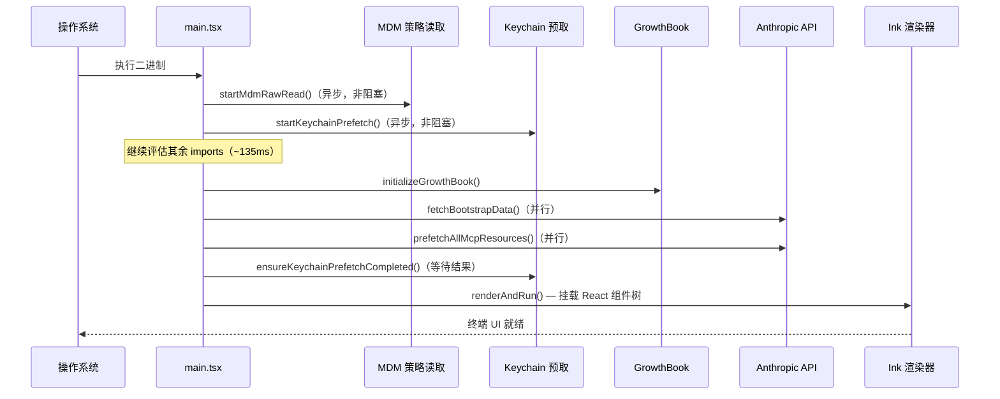
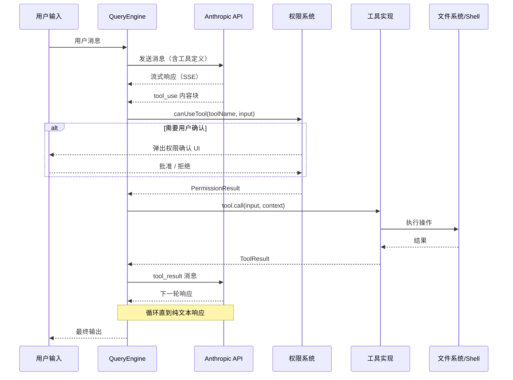

# 第 01 章：架构全景图

> 从 `main.tsx` 的第一行到多智能体协调层，Claude Code 的架构是一个以 LLM 查询引擎为核心、向外辐射出十余个子系统的同心圆结构。

---

## 入口点：`main.tsx`

`src/main.tsx` 是整个应用的入口，共 4,683 行。它承担三个核心职责：

1. **启动性能优化**：在任何其他 import 执行之前，立即触发并行的异步预取
2. **CLI 参数解析**：使用 Commander.js 注册所有子命令和选项
3. **React/Ink 渲染器初始化**：将终端 UI 挂载到 Ink 渲染树

文件的前 20 行揭示了一个精心设计的启动序列：

`src/main.tsx:1-20` — 在所有 import 评估完成之前，优先以副作用方式触发三个并行操作：

```typescript
// src/main.tsx:9-20（精简）
import { profileCheckpoint } from './utils/startupProfiler.js';
profileCheckpoint('main_tsx_entry');

import { startMdmRawRead } from './utils/settings/mdm/rawRead.js';
startMdmRawRead();  // 并行启动 MDM 策略读取（plutil/reg query 子进程）

import { startKeychainPrefetch } from './utils/secureStorage/keychainPrefetch.js';
startKeychainPrefetch();  // 并行预取 macOS Keychain（OAuth token + 旧版 API key）
```

注释中明确说明：macOS Keychain 的两次读取若串行执行约需 65ms，并行化可消除这部分启动延迟。这是一个以代码可读性换取启动性能的显式取舍，并通过 `eslint-disable custom-rules/no-top-level-side-effects` 注释标记为有意为之。

`src/main.tsx:74-82` — 使用 Bun 的 `feature()` 门控进行死代码消除：

```typescript
const coordinatorModeModule = feature('COORDINATOR_MODE')
  ? require('./coordinator/coordinatorMode.js')
  : null;

const assistantModule = feature('KAIROS')
  ? require('./assistant/index.js')
  : null;
```

`COORDINATOR_MODE`、`KAIROS`、`BRIDGE_MODE`、`PROACTIVE`、`DAEMON`、`VOICE_MODE` 等特性标志在构建时由 Bun 求值，未激活的分支在打包后的二进制中完全不存在。

---

## 高层架构图

```mermaid
graph TB
    subgraph 入口层
        MAIN["main.tsx\nCommander.js CLI 解析\nReact/Ink 渲染器"]
    end

    subgraph 核心引擎
        QE["QueryEngine.ts\nLLM 查询引擎\n流式响应 / 工具调用循环\n重试 / Token 计数"]
        QUERY["query.ts\nquery() 函数\n单次 API 调用封装"]
    end

    subgraph 上下文层
        CTX["context.ts\ngetSystemContext()\ngetUserContext()\ngit status / CLAUDE.md"]
        BOOTSTRAP["bootstrap/state.ts\n全局可变状态\n模型覆盖 / 会话信息"]
    end

    subgraph 工具系统
        TOOLS["tools.ts\n工具注册表\ngetTools()"]
        TOOLBASE["Tool.ts\n工具类型定义\nToolInput / PermissionResult"]
        TOOLIMPLS["tools/\n~40 个工具实现\nBash / FileEdit / Glob / Grep\nAgentTool / SkillTool / MCPTool\nTaskCreate / SendMessage / ..."]
    end

    subgraph 权限系统
        PERM["hooks/toolPermission/\nPermissionContext.ts\n权限模式: default/plan/acceptEdits/bypassPermissions/dontAsk/auto"]
        CANUSETOOL["hooks/useCanUseTool.tsx\nCanUseToolFn\n每次工具调用前检查"]
    end

    subgraph 命令系统
        CMDS["commands.ts\n命令注册表\ngetCommands()"]
        CMDIMPLS["commands/\n~50 个斜杠命令\n/commit /review /compact\n/mcp /memory /skills ..."]
    end

    subgraph 服务层
        API["services/api/\nAnthropic SDK 封装\nFile API / Bootstrap"]
        MCP["services/mcp/\nMCP 服务器连接\n官方注册表"]
        OAUTH["services/oauth/\nOAuth 2.0 流程"]
        LSP["services/lsp/\nLanguage Server Protocol"]
        ANALYTICS["services/analytics/\nGrowthBook 特性开关"]
        COMPACT["services/compact/\n上下文压缩"]
        PLUGINS_SVC["services/plugins/\n插件加载器"]
    end

    subgraph 多智能体系统
        AGENT["tools/AgentTool/\n子 Agent 生成\n颜色管理 / 定义加载"]
        COORDINATOR["coordinator/\ncoordinatorMode.ts\n多 Agent 协调"]
        SWARM["utils/swarm/\n团队模式\nTeamCreate / SendMessage"]
    end

    subgraph IDE 集成
        BRIDGE["bridge/\nbridgeMain.ts\n双向消息协议\nVS Code / JetBrains"]
        REPLBRIDGE["bridge/replBridge.ts\nREPL 会话桥接"]
    end

    subgraph 插件与技能
        PLUGINS["plugins/\nbundled/ + 第三方"]
        SKILLS["skills/\nbundled/ + 用户自定义\nSkillTool 执行"]
    end

    subgraph 持久化与状态
        MEMDIR["memdir/\n持久化记忆\n自动记忆提取"]
        STATE["state/AppState.js\n应用状态"]
        HISTORY["history.ts\n对话历史"]
        COSTTRACK["cost-tracker.ts\nToken 费用追踪"]
    end

    subgraph UI 层
        INK["ink/\nInk 渲染器封装"]
        COMPONENTS["components/\n~140 个 Ink UI 组件"]
        SCREENS["screens/\nDoctor / REPL / Resume"]
        HOOKS["hooks/\nReact Hooks (~80个)"]
    end

    MAIN --> QE
    MAIN --> CTX
    MAIN --> BOOTSTRAP
    MAIN --> CMDS
    MAIN --> TOOLS
    MAIN --> INK

    QE --> QUERY
    QE --> TOOLBASE
    QE --> PERM
    QE --> COSTTRACK
    QE --> MEMDIR

    QUERY --> API

    CTX --> BOOTSTRAP
    CTX --> MEMDIR

    TOOLS --> TOOLBASE
    TOOLS --> TOOLIMPLS
    TOOLIMPLS --> AGENT
    TOOLIMPLS --> SKILLS
    TOOLIMPLS --> MCP

    PERM --> CANUSETOOL

    CMDS --> CMDIMPLS
    CMDIMPLS --> COMPACT

    AGENT --> COORDINATOR
    AGENT --> SWARM

    API --> OAUTH
    MCP --> LSP
    ANALYTICS --> BOOTSTRAP

    BRIDGE --> REPLBRIDGE
    MAIN -.->|feature BRIDGE_MODE| BRIDGE

    PLUGINS --> PLUGINS_SVC
    SKILLS --> PLUGINS

    STATE --> HISTORY
    MAIN --> STATE

    INK --> COMPONENTS
    COMPONENTS --> HOOKS
    SCREENS --> INK
```



---

## 核心子系统详解

### 1. QueryEngine — 一切的中枢

`src/QueryEngine.ts`（1,295 行）是整个系统最重要的文件。它不直接调用 Anthropic API，而是通过 `src/query.ts` 中的 `query()` 函数作为单次调用的原子单元，在其上构建了完整的**工具调用循环**（agentic loop）：

- 向 Claude API 发送消息
- 接收流式响应
- 检测工具调用请求（`tool_use` 内容块）
- 通过 `CanUseToolFn` 检查权限
- 执行工具并将结果作为 `tool_result` 消息追加
- 重复上述过程，直到模型输出纯文本响应或达到循环上限

QueryEngine 还负责：Token 计数、费用追踪、重试逻辑（指数退避）、thinking 模式、快速模式（haiku 模型切换）、以及对话历史的持久化。

`src/QueryEngine.ts:1-8` — 文件开头即使用 `feature()` 门控，显示其与 Bun 构建系统的深度集成：

```typescript
import { feature } from 'bun:bundle'
```

### 2. 上下文系统 — 系统提示的组装

`src/context.ts` 提供两个关键函数，两者均使用 `lodash memoize` 缓存，确保单次会话内只计算一次：

**`getSystemContext()`**（`src/context.ts:116`）
- 收集 git 状态（branch、main branch、`git status --short`、最近 5 条提交）
- git status 超过 2,000 字符时截断
- 在远程模式（`CLAUDE_CODE_REMOTE`）下跳过 git 状态收集

**`getUserContext()`**（`src/context.ts:155`）
- 读取 `CLAUDE.md` 文件（从当前目录向上遍历，以及 `--add-dir` 指定的额外目录）
- 注入当前日期（`getLocalISODate()`）
- `--bare` 模式下跳过自动 `CLAUDE.md` 发现

这两个函数的输出最终被组装进发送给 Claude 的系统提示（system prompt）。

### 3. 工具系统 — 能力的载体

`src/Tool.ts`（792 行）定义了工具的类型基础。每个工具是一个结构化对象，包含：

- **输入 Schema**：`ToolInputJSONSchema`（基于 Zod v4）
- **权限模型**：每个工具声明自己需要哪种权限级别
- **执行函数**：接收 `ToolUseContext`，返回结果
- **进度状态类型**：`AgentToolProgress` 等用于流式进度更新

`src/tools/` 目录下约有 40 个工具实现，按子目录组织：

| 类别 | 工具 |
|------|------|
| 文件操作 | `FileReadTool`、`FileWriteTool`、`FileEditTool`、`GlobTool`、`GrepTool` |
| 命令执行 | `BashTool`、`PowerShellTool` |
| 智能体 | `AgentTool`、`SendMessageTool`、`TeamCreateTool`、`TeamDeleteTool` |
| 任务管理 | `TaskCreateTool`、`TaskGetTool`、`TaskListTool`、`TaskUpdateTool`、`TaskStopTool`、`TaskOutputTool` |
| 模式控制 | `EnterPlanModeTool`、`ExitPlanModeTool`、`EnterWorktreeTool`、`ExitWorktreeTool` |
| 外部集成 | `MCPTool`、`LSPTool`、`WebFetchTool`（通过 MCP）、`WebSearchTool` |
| 扩展 | `SkillTool`、`ToolSearchTool`、`SyntheticOutputTool`、`SleepTool` |

### 4. 权限系统 — 安全边界

`src/hooks/toolPermission/` 实现了六种权限模式（定义于 `src/utils/permissions/PermissionMode.ts`）：

- **`default`**：敏感操作（文件写入、命令执行）需要用户逐次确认
- **`plan`**：计划模式，写操作被阻止
- **`acceptEdits`**：自动接受文件编辑，命令执行仍需确认
- **`bypassPermissions`**：跳过所有权限检查（危险模式，需显式启用）
- **`dontAsk`**：遇到需要询问的操作直接拒绝
- **`auto`**：使用 AI 分类器自动批准/拒绝（仅内部版本，`TRANSCRIPT_CLASSIFIER` 特性标志门控）

`src/hooks/useCanUseTool.tsx` 暴露 `CanUseToolFn` 类型，QueryEngine 在执行每个工具调用前调用此函数。

### 5. 多智能体系统 — 并行工作的团队

这是 Claude Code 架构中最复杂的子系统之一：

- **`src/tools/AgentTool/`**：定义 Agent 的生成逻辑。Agent 是 Claude 的另一个实例，拥有独立的上下文窗口和工具集，通过 `SendMessageTool` 与主线程通信
- **`src/coordinator/coordinatorMode.ts`**：在 `COORDINATOR_MODE` 特性标志激活时，提供中央协调层，管理多个 Agent 的任务分配
- **`src/utils/swarm/`**：团队模式实现，包括 `TeamCreateTool`（创建 Agent 团队）和重连逻辑

`src/main.tsx:64-72` 中的懒加载模式避免了这些重量级模块的循环依赖：

```typescript
// 懒加载避免循环依赖: teammate.ts -> AppState.tsx -> ... -> main.tsx
const getTeammateUtils = () => require('./utils/teammate.js')
const getTeammatePromptAddendum = () => require('./utils/swarm/teammatePromptAddendum.js')
```

### 6. Bridge — IDE 的眼睛和手

`src/bridge/` 目录（约 30 个文件）实现了 Claude Code 与 IDE 扩展之间的双向通信协议：

- **`bridgeMain.ts`**：Bridge 主循环，仅在 `BRIDGE_MODE` 特性标志激活时运行
- **`bridgeMessaging.ts`**：定义消息协议格式
- **`replBridge.ts`**：将 CLI 的 REPL 会话暴露给 IDE
- **`jwtUtils.ts`**：基于 JWT 的双向认证
- **`sessionRunner.ts`**：会话执行与生命周期管理
- **`trustedDevice.ts`**：设备信任验证

Bridge 允许 VS Code 和 JetBrains 插件将文件选中内容、光标位置、诊断信息等 IDE 上下文注入 Claude Code 会话，并接收代码修改指令。

### 7. 服务层 — 外部世界的接口

`src/services/` 下的各子目录各司其职：

- **`services/api/`**：对 Anthropic SDK 的封装，包括 File API（上传图片/PDF）和 Bootstrap API（获取初始配置）
- **`services/mcp/`**：Model Context Protocol 的客户端实现，负责连接外部 MCP 服务器、获取工具列表和资源列表
- **`services/oauth/`**：完整的 OAuth 2.0 授权流程，支持 Claude.ai 账号登录
- **`services/analytics/`**：基于 GrowthBook 的特性开关和 A/B 测试，同时负责使用事件上报
- **`services/compact/`**：当上下文窗口接近上限时，对对话历史进行智能压缩
- **`services/extractMemories/`**：自动从对话中提取值得记忆的事实，写入 `memdir/`

### 8. UI 层 — React 在终端里运行

这是 Claude Code 最具特色的技术选型之一：使用 [Ink](https://github.com/vadimdemedes/ink) 在终端中渲染 React 组件树。

- **`src/ink/`**：对 Ink 渲染器的封装，包括终端 I/O 控制序列（`SHOW_CURSOR` 等 DEC 转义码）
- **`src/components/`**：约 140 个 Ink UI 组件，覆盖输入框、消息气泡、进度条、差异视图等
- **`src/hooks/`**：约 80 个 React Hooks，处理键盘输入、工具权限弹窗、滚动、Vim 模式等交互逻辑
- **`src/screens/`**：全屏界面，如 `/doctor` 诊断屏、REPL 屏、会话恢复屏

`src/context/` 目录中的 Context Provider 管理跨组件状态：`modalContext.tsx`、`QueuedMessageContext.tsx`、`mailbox.tsx`（Agent 消息信箱）等。

---

## 启动序列



---

## 数据流：一次工具调用的旅程



---

## 关键设计决策

### 并行预取优化启动速度

`src/main.tsx:13-20` 中的三行代码（`profileCheckpoint`、`startMdmRawRead`、`startKeychainPrefetch`）是一个典型的"不惜代码清洁度换性能"的工程决策。注释明确说明这些副作用必须在所有其他 import 之前运行，并通过 eslint 规则豁免标记。

### Bun `feature()` 实现死代码消除

不同于运行时的 `if/else`，`bun:bundle` 的 `feature()` 在构建时求值。这意味着未激活的特性（如 `VOICE_MODE`、`KAIROS`、`PROACTIVE`）在生产二进制中完全不存在，无法通过反编译找到。这是一种比代码混淆更彻底的特性保护机制。

### memoize 保证提示词缓存稳定性

`getSystemContext()` 和 `getUserContext()` 使用 `lodash memoize`（`src/context.ts:116, 155`）。这不仅是性能优化，更是为了保证发送给 Claude 的系统提示内容在单次会话内保持不变，从而充分利用 Anthropic API 的 prompt caching 功能（相同前缀的请求可以复用缓存，显著降低 Token 费用）。

### React Hooks 管理 CLI 交互状态

将 React 的状态管理模型（`useState`、`useEffect`、自定义 Hooks）应用于 CLI 的交互逻辑，是 Ink 框架带来的独特编程范式。`src/hooks/` 中约 80 个 Hooks 文件管理了从键盘绑定（`useCommandKeybindings.tsx`）到工具权限弹窗（`useCanUseTool.tsx`）的全部交互状态，这使得复杂的交互逻辑可以用声明式方式表达，而非命令式的事件监听器链。

---

## 小结

Claude Code 的架构可以用一句话概括：**以 `QueryEngine` 为心脏，以工具系统为四肢，以 React/Ink 为皮肤，以 Bridge 和 MCP 为神经末梢的 AI 编程助手**。

各子系统之间通过明确的接口边界解耦——工具通过 `CanUseToolFn` 接受权限检查，命令通过 `getCommands()` 注册表发现，MCP 服务器通过统一的 `MCPServerConnection` 类型接入。这种设计使得每个子系统都可以独立测试和迭代，而不会牵一发动全身。

下一章我们将深入 `QueryEngine.ts`，解析 LLM 调用循环的每一个细节。
