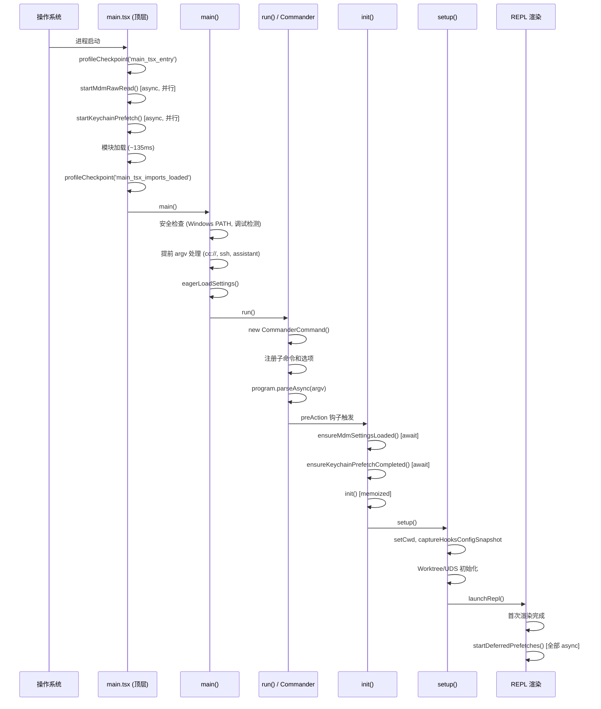

# 第二章：启动流程与性能优化

> Claude Code 的启动过程是一个精心设计的分层初始化序列。从进程创建到第一个用户交互界面出现，代码在每个环节都做了大量优化：并行预取、惰性加载、特性标志的死代码消除。本章深入分析这一过程中的关键决策。

## 2.1 启动入口：main.tsx 的顶层副作用

`src/main.tsx` 是整个 CLI 的入口文件。文件体量巨大（超过 785KB），承载了从命令解析到 REPL 启动的全部逻辑。

最引人注意的是文件**顶部的副作用代码**——在所有 `import` 语句之间，有三个刻意排列的立即执行调用（`src/main.tsx:9-20`）：

```typescript
import { profileCheckpoint, profileReport } from './utils/startupProfiler.js';
profileCheckpoint('main_tsx_entry');

import { startMdmRawRead } from './utils/settings/mdm/rawRead.js';
startMdmRawRead();   // 立即启动 MDM 子进程（plutil/reg query）

import { ensureKeychainPrefetchCompleted, startKeychainPrefetch } from './utils/secureStorage/keychainPrefetch.js';
startKeychainPrefetch(); // 立即启动 macOS Keychain 异步读取
```

代码注释解释了这一设计：macOS Keychain 的同步读取在每次启动时耗时约 65ms，通过在模块求值阶段就启动异步预取，使这部分延迟与后续 ~135ms 的模块加载并行进行，从而隐藏在不可避免的导入开销中。

第三个副作用是性能检查点标记，配合 `src/utils/startupProfiler.ts` 实现启动耗时的采样上报。

## 2.2 bun:bundle 特性标志与死代码消除

文件中频繁出现 `feature()` 调用（`src/main.tsx:21`）：

```typescript
import { feature } from 'bun:bundle';
```

`bun:bundle` 是 Bun 构建器的专属 API。`feature('FLAG_NAME')` 在构建阶段被替换为 `true` 或 `false` 字面量，随后标准的 JavaScript 压缩器（tree-shaker）可以消除永远不会执行的代码分支。

这一机制在代码库中被大量使用，主要集中在两类场景：

**场景一：条件模块加载（`src/main.tsx:76-81`）**

```typescript
// Dead code elimination: conditional import for COORDINATOR_MODE
const coordinatorModeModule = feature('COORDINATOR_MODE')
  ? require('./coordinator/coordinatorMode.js')
  : null;

// Dead code elimination: conditional import for KAIROS (assistant mode)
const assistantModule = feature('KAIROS')
  ? require('./assistant/index.js')
  : null;
```

`COORDINATOR_MODE` 和 `KAIROS` 是面向不同用户群体（内部 Ant 员工 vs 外部用户）的功能。当特性标志为 `false` 时，对应模块的代码不会出现在最终产物中，外部版本的包体积得以保持精简。

**场景二：运行时行为门控（`src/setup.ts:95-100`）**

```typescript
if (feature('UDS_INBOX')) {
  const m = await import('./utils/udsMessaging.js')
  await m.startUdsMessaging(...)
}
```

这里使用动态 `import()` 而非顶层 `require()`，配合特性门控，确保模块只在需要时才被加载。

同样的模式在 `src/tools.ts` 中被广泛应用于工具注册（`src/tools.ts:16-135`），几十个工具通过特性标志选择性地加入工具集合。

## 2.3 Commander.js CLI 解析架构

主命令解析在 `run()` 函数中完成（`src/main.tsx:884`）。Commander.js 通过 `@commander-js/extra-typings` 包引入，提供完整的 TypeScript 类型支持。

```typescript
const program = new CommanderCommand()
  .configureHelp(createSortedHelpConfig())
  .enablePositionalOptions();
```

`enablePositionalOptions()` 的启用使得子命令能够拥有独立的选项命名空间，避免与父命令产生冲突。

**preAction 钩子是关键的初始化时机点**（`src/main.tsx:907-935`）：

```typescript
program.hook('preAction', async thisCommand => {
  profileCheckpoint('preAction_start');
  // 等待模块加载阶段启动的异步任务完成
  await Promise.all([ensureMdmSettingsLoaded(), ensureKeychainPrefetchCompleted()]);
  await init();   // 核心初始化
  initSinks();    // 接入日志/遥测管道
});
```

使用 `preAction` 钩子而非在 `action` 回调中初始化的原因是：当用户请求 `--help` 时，Commander 不会触发 `preAction`，从而避免不必要的初始化开销。

## 2.4 子命令注册模式

Claude Code 拥有大量子命令（`mcp serve`、`doctor`、`auth`、`plugin` 等）。这些命令通过专门的注册函数添加（`src/main.tsx:141-143`）：

```typescript
import { registerMcpAddCommand } from 'src/commands/mcp/addCommand.js';
import { registerMcpXaaIdpCommand } from 'src/commands/mcp/xaaIdpCommand.js';
```

部分子命令在 `main()` 函数顶部做了提前处理——在 Commander 解析之前，代码就对 `process.argv` 进行了扫描和改写。以 `ssh` 子命令为例（`src/main.tsx:706-784`），系统会提前提取主机名、工作目录、权限模式等参数，存入模块级变量 `_pendingSSH`，随后从 `argv` 中移除这些参数，让主命令正常运行交互式 REPL，再在合适的时机将 SSH 会话信息注入。

这种"提前解析、延迟消费"的模式被用于多个功能：
- `DIRECT_CONNECT`（`cc://` URL 协议）：`src/main.tsx:612-642`
- `KAIROS`（assistant 子命令）：`src/main.tsx:685-700`
- `SSH_REMOTE`（ssh 子命令）：`src/main.tsx:706-770`

## 2.5 init() 初始化序列

核心初始化逻辑在 `src/entrypoints/init.ts` 的 `init()` 函数中，它被 `memoize` 包裹确保只执行一次（`src/entrypoints/init.ts:57`）：

```typescript
export const init = memoize(async (): Promise<void> => {
  enableConfigs()                      // 启用配置系统，验证配置合法性
  applySafeConfigEnvironmentVariables() // 安全地应用部分环境变量（信任对话框前）
  applyExtraCACertsFromConfig()        // 应用 TLS CA 证书配置
  // ...
})
```

`init()` 与 `setup()` 的分工是：`init()` 负责与会话无关的全局初始化（配置、遥测、证书），而 `setup()` 处理每次会话的上下文初始化，包括工作目录、Hook 快照、Worktree 创建等。

## 2.6 setup() 会话初始化

`src/setup.ts` 中的 `setup()` 函数接收会话相关参数（`src/setup.ts:56-66`）：

```typescript
export async function setup(
  cwd: string,
  permissionMode: PermissionMode,
  allowDangerouslySkipPermissions: boolean,
  worktreeEnabled: boolean,
  // ...
): Promise<void>
```

`setup()` 执行的关键步骤（按顺序）：
1. Node.js 版本检查（`>= 18`）
2. UDS 消息服务器启动（由 `UDS_INBOX` 特性门控）
3. Teammate 快照捕获（多智能体模式）
4. 终端备份恢复检测（iTerm2 / Terminal.app）
5. `setCwd()` 设置工作目录
6. `captureHooksConfigSnapshot()` 固定 Hook 配置（防止 Hook 在运行中被篡改）
7. 文件变更监听器初始化
8. Worktree 创建（如果 `--worktree` 被启用）

## 2.7 延迟预取：startDeferredPrefetches()

`src/main.tsx:388` 定义了 `startDeferredPrefetches()`，它在 REPL 首次渲染完成**之后**调用，而非阻塞在启动关键路径上：

```typescript
export function startDeferredPrefetches(): void {
  void initUser();
  void getUserContext();
  prefetchSystemContextIfSafe();
  void getRelevantTips();
  void countFilesRoundedRg(getCwd(), AbortSignal.timeout(3000), []);
  void initializeAnalyticsGates();
  void prefetchOfficialMcpUrls();
  void refreshModelCapabilities();
  void settingsChangeDetector.initialize();
}
```

所有调用均使用 `void` 前缀（即 fire-and-forget），它们与用户首次输入并行执行。注意 `prefetchSystemContextIfSafe()` 包含安全检查——只有在信任对话框已接受的情况下才会触发 `getSystemContext()`（后者会调用 git 命令），因为 git 的钩子和配置（`core.fsmonitor`、`diff.external`）可能执行任意代码。

## 2.8 启动性能监测体系

`src/utils/startupProfiler.ts` 实现了一套分层采样的性能监测机制：

- Ant 内部用户：100% 采样上报到 Statsig
- 外部用户：0.5% 概率采样（`STATSIG_SAMPLE_RATE = 0.005`）
- 本地调试：`CLAUDE_CODE_PROFILE_STARTUP=1` 启用完整的内存快照报告

定义的关键阶段（`src/utils/startupProfiler.ts:49-53`）：

```typescript
const PHASE_DEFINITIONS = {
  import_time: ['cli_entry', 'main_tsx_imports_loaded'],
  init_time: ['init_function_start', 'init_function_end'],
  settings_time: ['eagerLoadSettings_start', 'eagerLoadSettings_end'],
  total_time: ['cli_entry', 'main_after_run'],
}
```

## 2.9 启动流程总览



## 2.10 entrypoints 目录

`src/entrypoints/` 目录包含不同使用场景的入口适配层：

| 文件 | 用途 |
|------|------|
| `init.ts` | 核心初始化逻辑（memoized） |
| `cli.tsx` | 标准 CLI 交互模式入口 |
| `mcp.ts` | MCP 服务器模式入口 |
| `sdk/` | SDK 模式（TypeScript/Python SDK 调用） |
| `agentSdkTypes.ts` | Agent SDK 专用类型定义 |

这种分层使得相同的核心逻辑可以通过不同的"壳"暴露给不同的调用方，而 `CLAUDE_CODE_ENTRYPOINT` 环境变量则用于在运行时识别当前入口类型（`src/main.tsx:517-540`）。
