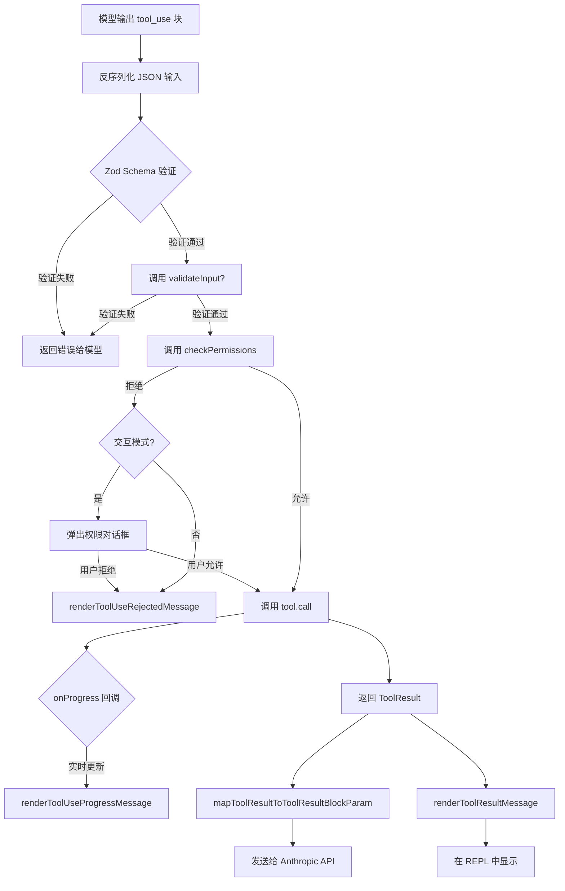

# 第三章：工具系统设计

> Claude Code 的工具系统是其核心架构之一，定义了 AI 模型与宿主环境交互的完整协议。从类型定义到权限检查，从 Zod 模式验证到 React 渲染，工具系统优雅地将安全性、可扩展性和用户体验融为一体。

## 3.1 Tool 接口：系统的核心契约

所有工具的类型定义集中在 `src/Tool.ts`。核心是一个三参数泛型接口（`src/Tool.ts:362-366`）：

```typescript
export type Tool<
  Input extends AnyObject = AnyObject,
  Output = unknown,
  P extends ToolProgressData = ToolProgressData,
> = {
  // ...
}
```

三个类型参数的含义：
- `Input`：工具输入的 Zod Schema 类型，约束了模型能传递的参数结构
- `Output`：工具执行结果的类型
- `P`：流式进度消息的类型，用于长时间运行操作的实时反馈

`AnyObject` 被定义为 `z.ZodType<{ [key: string]: unknown }>`（`src/Tool.ts:343`），确保所有工具输入都是可 JSON 化的对象。

## 3.2 Tool 接口的关键方法

### call()：核心执行方法

```typescript
call(
  args: z.infer<Input>,
  context: ToolUseContext,
  canUseTool: CanUseToolFn,
  parentMessage: AssistantMessage,
  onProgress?: ToolCallProgress<P>,
): Promise<ToolResult<Output>>
```

`call()` 接收五个参数。其中 `canUseTool` 是一个回调函数，允许工具在执行过程中动态请求额外权限（例如 AgentTool 为子代理请求权限）。`onProgress` 是可选的流式进度回调，用于向 UI 推送中间状态。

### checkPermissions()：权限决策

```typescript
checkPermissions(
  input: z.infer<Input>,
  context: ToolUseContext,
): Promise<PermissionResult>
```

这是工具**特定**权限逻辑的入口。通用权限逻辑（模式检查、规则匹配）在 `permissions.ts` 中，而工具特定的判断（例如 BashTool 解析命令语义）在这里实现。

### validateInput()：语义验证

```typescript
validateInput?(
  input: z.infer<Input>,
  context: ToolUseContext,
): Promise<ValidationResult>
```

在 `checkPermissions()` 之前调用，用于验证输入的语义合法性（而非 Zod 提供的结构验证）。例如检查文件路径是否合理、命令是否包含禁止的模式。

### isReadOnly() 和 isDestructive()

```typescript
isReadOnly(input: z.infer<Input>): boolean
isDestructive?(input: z.infer<Input>): boolean
```

这两个方法用于工具分类。`isReadOnly` 返回 `true` 的工具（如 FileReadTool、GrepTool）在 `--permission-mode=read-only` 下无需询问用户。`isDestructive` 标记不可逆操作（删除、覆盖写入、发送消息），会在 UI 中以特殊样式提示用户。

注意 `isDestructive` 是可选方法（默认为 `false`），而 `isReadOnly` 是必须实现的方法，默认值由 `buildTool()` 提供（`src/Tool.ts:757-769`）。

### prompt()：系统提示生成

```typescript
prompt(options: {
  getToolPermissionContext: () => Promise<ToolPermissionContext>
  tools: Tools
  agents: AgentDefinition[]
  allowedAgentTypes?: string[]
}): Promise<string>
```

每个工具负责生成自己在系统提示中的描述文本。这使得工具能够根据当前权限上下文动态调整描述——例如在只读模式下，BashTool 的描述会省略写入相关的示例。

### userFacingName()：显示名称

```typescript
userFacingName(input: Partial<z.infer<Input>> | undefined): string
```

接收**部分**输入（因为流式传输时参数可能还未完整到达），返回用户界面展示的名称。例如 BashTool 会在执行 `git status` 时显示 "Bash(git status)" 而非纯粹的 "Bash"。

## 3.3 ToolResult 类型

工具执行结果被包装在 `ToolResult<T>` 中（`src/Tool.ts:321-336`）：

```typescript
export type ToolResult<T> = {
  data: T
  newMessages?: (UserMessage | AssistantMessage | AttachmentMessage | SystemMessage)[]
  contextModifier?: (context: ToolUseContext) => ToolUseContext
  mcpMeta?: {
    _meta?: Record<string, unknown>
    structuredContent?: Record<string, unknown>
  }
}
```

`contextModifier` 是一个强大但受限的能力——工具可以通过它修改后续工具调用的上下文（例如切换工作目录），但只对非并发安全的工具有效（注释中明确说明：`contextModifier is only honored for tools that aren't concurrency safe`）。

## 3.4 ToolUseContext：运行时上下文对象

`ToolUseContext` 是传递给每个工具调用的运行时"环境"，包含数十个字段（`src/Tool.ts:158-300`）。主要分组如下：

**配置选项**
```typescript
options: {
  commands: Command[]
  debug: boolean
  mainLoopModel: string
  tools: Tools
  verbose: boolean
  thinkingConfig: ThinkingConfig
  mcpClients: MCPServerConnection[]
  isNonInteractiveSession: boolean
  // ...
}
```

**状态访问**
```typescript
abortController: AbortController      // 用于取消正在执行的工具
readFileState: FileStateCache          // 文件读取缓存（用于检测过期写入）
getAppState(): AppState
setAppState(f: (prev: AppState) => AppState): void
messages: Message[]                    // 完整的对话历史
```

**UI 回调**（仅交互模式可用）
```typescript
setToolJSX?: SetToolJSXFn             // 向 UI 注入自定义 React 节点
addNotification?: (notif: Notification) => void
appendSystemMessage?: (...) => void
sendOSNotification?: (...) => void
```

**子代理支持**
```typescript
agentId?: AgentId                     // 仅子代理设置
agentType?: string                    // 子代理类型名
setAppStateForTasks?: (...)           // 跨代理层级的状态更新
```

`ToolUseContext` 设计为**深度不可变**（`DeepImmutable<...>`）的权限上下文字段，确保工具不能篡改权限规则。

## 3.5 buildTool()：工具构造辅助函数

直接实现 `Tool` 接口需要提供所有方法，包括许多有合理默认值的方法。`buildTool()` 解决了这个问题（`src/Tool.ts:783-792`）：

```typescript
export function buildTool<D extends AnyToolDef>(def: D): BuiltTool<D> {
  return {
    ...TOOL_DEFAULTS,
    userFacingName: () => def.name,
    ...def,
  } as BuiltTool<D>
}
```

默认值（`src/Tool.ts:757-769`，注释标注了安全策略为"fail-closed"）：
- `isEnabled` → `true`
- `isConcurrencySafe` → `false`（假设不并发安全）
- `isReadOnly` → `false`（假设会写入）
- `isDestructive` → `false`
- `checkPermissions` → 允许（把决策权交给通用权限系统）
- `toAutoClassifierInput` → `''`（跳过安全分类器，安全相关的工具**必须**覆盖此方法）
- `userFacingName` → `name`

`ToolDef` 类型是 `Tool` 的偏应用版本，所有可被默认填充的方法都是可选的。

## 3.6 工具注册与发现

所有工具在 `src/tools.ts` 中统一注册。`getAllBaseTools()` 函数是工具集合的真实来源（`src/tools.ts:193`）：

```typescript
export function getAllBaseTools(): Tools {
  return [
    AgentTool,
    TaskOutputTool,
    BashTool,
    GrepTool,
    FileReadTool,
    FileEditTool,
    FileWriteTool,
    GlobTool,
    // ...
  ]
}
```

动态工具（受特性标志或环境变量控制）通过条件 `require()` 在模块顶层注册，利用 `bun:bundle` 的死代码消除能力确保未启用的工具不会被打包（`src/tools.ts:16-135`）：

```typescript
const REPLTool = process.env.USER_TYPE === 'ant'
  ? require('./tools/REPLTool/REPLTool.js').REPLTool
  : null

const SleepTool = feature('PROACTIVE') || feature('KAIROS')
  ? require('./tools/SleepTool/SleepTool.js').SleepTool
  : null
```

MCP 工具则在运行时动态生成并加入工具集合，不在静态列表中。

## 3.7 Zod Schema 验证：lazySchema 模式

所有工具使用 Zod v4 定义输入 Schema，并搭配 `lazySchema()` 辅助函数延迟初始化（`src/tools/BashTool/BashTool.tsx:227`）：

```typescript
const fullInputSchema = lazySchema(() => z.strictObject({
  command: z.string().describe('The command to execute'),
  timeout: semanticNumber(z.number().optional()).describe(
    `Optional timeout in milliseconds (max ${getMaxTimeoutMs()})`
  ),
  description: z.string().optional().describe(`...`),
  run_in_background: semanticBoolean(z.boolean().optional()).describe(`...`),
  dangerouslyDisableSandbox: semanticBoolean(z.boolean().optional()).describe('...'),
}));
```

`lazySchema()` 的作用是延迟 Schema 的创建，避免在模块加载时就调用需要配置读取的函数（如 `getMaxTimeoutMs()`）。`semanticNumber` 和 `semanticBoolean` 是自定义 Zod 装饰器，允许模型传入字符串形式的数字/布尔值（如 `"true"` 或 `"5000"`）并自动转换，增加对模型输出的容错性。

## 3.8 典型工具解析：BashTool

BashTool 是系统中最复杂、最重要的工具（`src/tools/BashTool/BashTool.tsx`）。

**Schema 设计的安全考量**

`_simulatedSedEdit` 字段是一个内部字段，永远不会暴露给模型（`src/tools/BashTool/BashTool.tsx:249-258`）：

```typescript
// Always omit _simulatedSedEdit from the model-facing schema.
// Exposing it would let the model bypass permission checks and the sandbox
// by pairing an innocuous command with an arbitrary file write.
const inputSchema = lazySchema(() =>
  isBackgroundTasksDisabled
    ? fullInputSchema().omit({ run_in_background: true, _simulatedSedEdit: true })
    : fullInputSchema().omit({ _simulatedSedEdit: true })
);
```

**命令语义分类**

BashTool 维护了多个命令集合用于 UI 折叠显示（`src/tools/BashTool/BashTool.tsx:60-81`）：

```typescript
const BASH_SEARCH_COMMANDS = new Set(['find', 'grep', 'rg', 'ag', 'ack', 'locate', ...]);
const BASH_READ_COMMANDS = new Set(['cat', 'head', 'tail', 'less', 'jq', 'awk', ...]);
const BASH_LIST_COMMANDS = new Set(['ls', 'tree', 'du']);
const BASH_SILENT_COMMANDS = new Set(['mv', 'cp', 'rm', 'mkdir', 'chmod', ...]);
```

`isSearchOrReadBashCommand()` 函数解析管道命令（使用 bash AST 解析器），确定整个命令链是否为只读/搜索性质，从而决定是否在 UI 中折叠展示。

**权限系统**

BashTool 的权限逻辑在 `src/tools/BashTool/bashPermissions.ts` 中，通过 bash AST 解析实现细粒度的命令语义理解——支持通配符规则（如 `git *`）、路径约束、操作符检查（防止 `safe-cmd && dangerous-cmd` 绕过）等。

**输出 Schema**

BashTool 的输出 Schema 同样完整（`src/tools/BashTool/BashTool.tsx:279-294`）：

```typescript
const outputSchema = lazySchema(() => z.object({
  stdout: z.string(),
  stderr: z.string(),
  interrupted: z.boolean(),
  backgroundTaskId: z.string().optional(),
  persistedOutputPath: z.string().optional(), // 输出过大时持久化到磁盘
  persistedOutputSize: z.number().optional(),
  // ...
}));
```

`persistedOutputPath` 是一个重要的性能优化——当命令输出过大时，实际内容被写入临时文件，模型只收到文件路径和预览，避免撑爆上下文窗口。

## 3.9 典型工具解析：FileReadTool

FileReadTool 是一个典型的只读工具（`src/tools/FileReadTool/FileReadTool.ts`）。

输入 Schema 设计（`src/tools/FileReadTool/FileReadTool.ts:227-243`）：

```typescript
const inputSchema = lazySchema(() =>
  z.strictObject({
    file_path: z.string().describe('The absolute path to the file to read'),
    offset: semanticNumber(z.number().int().nonnegative().optional()),
    limit: semanticNumber(z.number().int().positive().optional()),
    pages: z.string().optional(), // 仅 PDF 文件，如 "1-5"
  })
)
```

FileReadTool 的安全设计体现在两处：

1. **阻止设备文件**（`src/tools/FileReadTool/FileReadTool.ts:98-115`）：显式列出 `/dev/zero`、`/dev/random`、`/dev/stdin` 等会导致进程挂起或无限输出的设备文件。

2. **maxResultSizeChars 设置为 Infinity**：工具接口允许每个工具设置结果最大大小（超出则持久化到磁盘），但 FileReadTool 将此值设为 `Infinity` 并通过自身的 `offset`/`limit` 参数自我约束，避免"持久化→再读取→再持久化"的循环。

## 3.10 典型工具解析：AgentTool

AgentTool 是工具系统中最复杂的一个，它能够产生子代理（`src/tools/AgentTool/AgentTool.tsx`）。

输入 Schema 具有三层结构（`src/tools/AgentTool/AgentTool.tsx:82-102`）：

```typescript
// 基础层：所有代理共有
const baseInputSchema = lazySchema(() => z.object({
  description: z.string(),     // 任务的3-5词描述
  prompt: z.string(),          // 代理要执行的任务
  subagent_type: z.string().optional(),
  model: z.enum(['sonnet', 'opus', 'haiku']).optional(),
  run_in_background: z.boolean().optional(),
}));

// 扩展层：多代理参数（团队功能）
// 通过 .merge() 组合，支持 name, team_name, mode 字段

// 隔离层：worktree / remote 隔离模式
// 通过 .extend() 添加 isolation 和 cwd 字段
```

AgentTool 使用 `bun:bundle` 的特性标志控制 `KAIROS` 模式下是否暴露 `cwd` 参数（`src/tools/AgentTool/AgentTool.tsx:111-113`）：

```typescript
const schema = feature('KAIROS')
  ? fullInputSchema()
  : fullInputSchema().omit({ cwd: true });
```

AgentTool 同样使用 `feature()` 来条件加载重量级的 `proactive` 模块：

```typescript
const proactiveModule = feature('PROACTIVE') || feature('KAIROS')
  ? require('../../proactive/index.js')
  : null;
```

## 3.11 工具执行生命周期



## 3.12 工具分类体系

工具按照读写属性分为三类，这一分类直接影响权限模式下的行为：

| 类别 | 代表工具 | isReadOnly | isDestructive | 权限要求 |
|------|---------|-----------|--------------|---------|
| 只读工具 | FileReadTool, GrepTool, GlobTool | `true` | `false` | read-only 模式下免询问 |
| 安全写入 | FileEditTool, FileWriteTool | `false` | `false` | 默认需要询问（可添加规则） |
| 破坏性工具 | BashTool（rm 命令）, FileWriteTool（覆盖）| `false` | `true`（部分） | 需要额外确认 |

`isDestructive` 的实现是**基于输入的动态判断**，而非静态属性。BashTool 会解析命令内容，FileWriteTool 会检查目标路径是否已存在。这种设计使权限系统能够在同一个工具的不同操作间做出差异化决策。

## 3.13 工具搜索与延迟加载

`Tool` 接口包含两个控制工具可见性的字段（`src/Tool.ts:438-449`）：

```typescript
readonly shouldDefer?: boolean  // true = 需要先 ToolSearch，才能调用
readonly alwaysLoad?: boolean   // true = 永远在初始提示中出现，不被延迟
```

当 `shouldDefer: true` 时，工具的完整 Schema 不会出现在初始系统提示中，只有工具名称和 `searchHint` 字段会被发送。模型需要先调用 `ToolSearch` 工具获取完整 Schema，再发起实际调用。这一机制减少了系统提示的 token 消耗，对于拥有大量 MCP 工具的场景尤为关键。

```typescript
searchHint?: string  // 3-10 词的关键词描述，用于 ToolSearch 的关键词匹配
```

这构成了一个三级工具发现体系：
1. **始终加载**（`alwaysLoad: true`）：核心工具（Bash、Read、Edit 等）
2. **可搜索**（`shouldDefer: true`）：专用工具，通过 ToolSearch 发现
3. **条件加载**（特性标志控制）：实验性或用户群专属工具，在构建阶段消除
