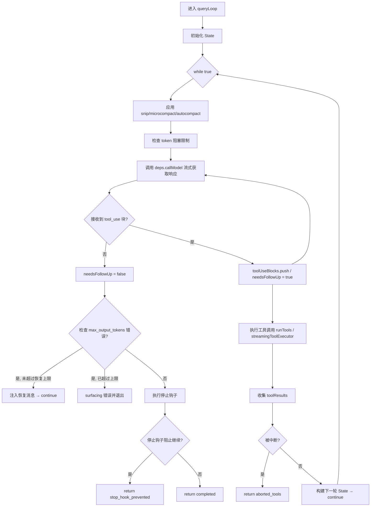
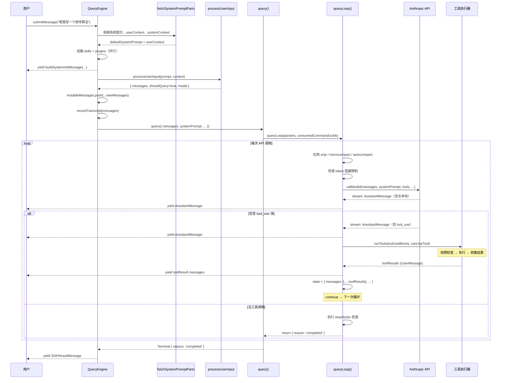

# 第四章：LLM 查询引擎

> Claude Code 的核心是一台精密的查询机器。每一次用户消息，都要经过 `QueryEngine` 编排、`query()` 调度、`queryLoop()` 驱动的完整流水线，才能变成你在终端看到的那些流式文本与工具调用结果。本章深入解剖这台机器的每一个齿轮。

---

## 4.1 QueryEngineConfig：查询引擎的配置清单

`QueryEngine` 类在 `src/QueryEngine.ts` 第 130–173 行定义了一个名为 `QueryEngineConfig` 的类型，它是整个引擎的"出厂设定"，涵盖运行时所需的全部依赖与参数：

```typescript
// src/QueryEngine.ts:130
export type QueryEngineConfig = {
  cwd: string                        // 工作目录
  tools: Tools                       // 可用工具集
  commands: Command[]                // 斜杠命令列表
  mcpClients: MCPServerConnection[]  // MCP 服务器连接
  agents: AgentDefinition[]          // 子 Agent 定义
  canUseTool: CanUseToolFn           // 权限检查回调
  getAppState: () => AppState        // 读取全局状态
  setAppState: (f: ...) => void      // 更新全局状态
  initialMessages?: Message[]        // 初始消息历史
  readFileCache: FileStateCache      // 文件状态缓存
  customSystemPrompt?: string        // 自定义系统提示
  appendSystemPrompt?: string        // 追加系统提示
  userSpecifiedModel?: string        // 用户指定模型
  fallbackModel?: string             // 降级备用模型
  thinkingConfig?: ThinkingConfig    // 思考模式配置
  maxTurns?: number                  // 最大轮次限制
  maxBudgetUsd?: number              // 最大花费上限（USD）
  taskBudget?: { total: number }     // API 任务预算
  jsonSchema?: Record<string, unknown> // 结构化输出 Schema
  verbose?: boolean                  // 详细日志
  replayUserMessages?: boolean       // SDK 消息回放
  handleElicitation?: ...            // MCP URL 询问处理器
  includePartialMessages?: boolean   // 包含部分消息
  setSDKStatus?: (status: SDKStatus) => void  // SDK 状态回调
  abortController?: AbortController  // 外部中断控制器
  orphanedPermission?: OrphanedPermission     // 遗留权限处理
  snipReplay?: (...)                 // 历史片段回放钩子
}
```

这个配置类型的设计体现了一个重要原则：**QueryEngine 是无状态依赖的**。它通过 `getAppState`/`setAppState` 访问全局状态，通过 `canUseTool` 委托权限决策，通过 `tools` 注入工具集——所有外部依赖都以参数形式传入，使得 QueryEngine 本身易于测试和复用。

---

## 4.2 QueryEngine 类：会话的状态管理者

`QueryEngine` 类（`src/QueryEngine.ts:184`）是整个会话生命周期的拥有者。它的私有字段揭示了跨轮次需要持久化的核心状态：

```typescript
// src/QueryEngine.ts:184
export class QueryEngine {
  private config: QueryEngineConfig
  private mutableMessages: Message[]          // 消息历史（可变）
  private abortController: AbortController    // 中断控制器
  private permissionDenials: SDKPermissionDenial[]  // 权限拒绝记录
  private totalUsage: NonNullableUsage        // 累计 token 用量
  private hasHandledOrphanedPermission = false
  private discoveredSkillNames = new Set<string>()  // 已发现的技能
  private loadedNestedMemoryPaths = new Set<string>() // 已加载记忆路径
```

构造函数（第 200–207 行）只做简单初始化：

```typescript
// src/QueryEngine.ts:200
constructor(config: QueryEngineConfig) {
  this.config = config
  this.mutableMessages = config.initialMessages ?? []
  this.abortController = config.abortController ?? createAbortController()
  this.permissionDenials = []
  this.readFileState = config.readFileCache
  this.totalUsage = EMPTY_USAGE
}
```

关键设计点：`discoveredSkillNames` 在每次 `submitMessage()` 开头被清空（第 238 行），避免跨轮次的技能发现记录无限增长；而 `loadedNestedMemoryPaths` 则在整个引擎生命周期内持续积累，保证嵌套记忆文件不会被重复加载。

---

## 4.3 submitMessage()：一切从这里开始

`submitMessage()` 是 `QueryEngine` 对外暴露的核心方法，签名为：

```typescript
// src/QueryEngine.ts:209
async *submitMessage(
  prompt: string | ContentBlockParam[],
  options?: { uuid?: string; isMeta?: boolean },
): AsyncGenerator<SDKMessage, void, unknown>
```

它是一个**异步生成器**（`async *`），调用方通过 `for await ... of` 逐条接收 `SDKMessage`。这种设计允许引擎在处理过程中实时流式输出，而不必等到整个响应完成。

`submitMessage()` 的执行流程可分为以下阶段：

### 阶段一：初始化与系统提示构建

```typescript
// src/QueryEngine.ts:284-325
headlessProfilerCheckpoint('before_getSystemPrompt')
const { defaultSystemPrompt, userContext, systemContext } =
  await fetchSystemPromptParts({ tools, mainLoopModel, ... })

const systemPrompt = asSystemPrompt([
  ...(customPrompt !== undefined ? [customPrompt] : defaultSystemPrompt),
  ...(memoryMechanicsPrompt ? [memoryMechanicsPrompt] : []),
  ...(appendSystemPrompt ? [appendSystemPrompt] : []),
])
```

系统提示由三部分拼接而成：自定义提示（或默认提示）、记忆机制提示（当 `CLAUDE_COWORK_MEMORY_PATH_OVERRIDE` 环境变量激活时）、以及追加提示。

### 阶段二：加载技能与插件

```typescript
// src/QueryEngine.ts:534-551
const [skills, { enabled: enabledPlugins }] = await Promise.all([
  getSlashCommandToolSkills(getCwd()),
  loadAllPluginsCacheOnly(),
])

yield buildSystemInitMessage({
  tools, mcpClients, model: mainLoopModel,
  permissionMode, commands, agents, skills, plugins: enabledPlugins,
  fastMode: initialAppState.fastMode,
})
```

技能（Skills）来自当前工作目录下的斜杠命令工具；插件（Plugins）仅从缓存加载（`CacheOnly`），避免在每次请求时触发网络操作。加载完成后立即向调用方 `yield` 一个系统初始化消息。

### 阶段三：处理用户输入

通过 `processUserInput()` 处理斜杠命令、消息附件等，得到最终要进入 LLM 的消息数组。若输入触发了本地斜杠命令（如 `/help`），`shouldQuery` 为 `false`，引擎直接返回命令结果，不调用 API。

### 阶段四：调用 query() 并转发消息流

```typescript
// src/QueryEngine.ts:675
for await (const message of query({
  messages, systemPrompt, userContext, systemContext,
  canUseTool: wrappedCanUseTool,
  toolUseContext: processUserInputContext,
  fallbackModel, querySource: 'sdk', maxTurns, taskBudget,
})) {
  // 记录 assistant/user 消息到历史与转录
  // 更新 token 用量
  // 向调用方转发消息
}
```

`wrappedCanUseTool`（第 244–271 行）是对原始 `canUseTool` 的包装，额外追踪每次权限拒绝事件，最终记录在 `permissionDenials` 数组中，供 SDK 结果消息使用。

---

## 4.4 QueryParams 与 State：查询循环的骨架

在 `src/query.ts` 中，`query()` 函数接受 `QueryParams` 类型参数，进入 `queryLoop()` 后维护一个关键的可变状态对象 `State`：

```typescript
// src/query.ts:204
type State = {
  messages: Message[]                           // 当前消息列表
  toolUseContext: ToolUseContext                 // 工具执行上下文
  autoCompactTracking: AutoCompactTrackingState | undefined  // 自动压缩追踪
  maxOutputTokensRecoveryCount: number          // max_output_tokens 恢复计数
  hasAttemptedReactiveCompact: boolean          // 是否已尝试响应式压缩
  maxOutputTokensOverride: number | undefined   // token 上限覆盖值
  pendingToolUseSummary: Promise<...> | undefined  // 待处理工具摘要
  stopHookActive: boolean | undefined           // 停止钩子是否激活
  turnCount: number                             // 当前轮次计数
  transition: Continue | undefined              // 上次迭代的继续原因
}
```

`State` 是整个循环的"血液"——每次需要继续下一轮（因工具调用、恢复 token 限制、压缩等原因），都通过 `state = { ...newState }; continue` 进入下一次循环迭代，而不是递归调用。这是一个扁平化的状态机设计。

---

## 4.5 queryLoop()：无限循环驱动的状态机

`queryLoop()` 函数（`src/query.ts:241`）是整个 LLM 交互的核心引擎。它是一个 `while(true)` 循环，每次迭代代表一个完整的"模型调用 + 工具执行"周期：



### 压缩前置处理

在每次 API 调用前，`queryLoop` 依次执行三层上下文管理：

1. **Snip 压缩**（`HISTORY_SNIP` feature flag）：剪除过旧的历史片段，释放 token（第 401–410 行）
2. **Microcompact**：将相似的重复工具结果合并（第 414–426 行）
3. **Autocompact**：当上下文窗口达到阈值时，使用 Haiku 模型生成摘要并替换历史（第 454–543 行）

### 流式接收响应

```typescript
// src/query.ts:659
for await (const message of deps.callModel({
  messages: prependUserContext(messagesForQuery, userContext),
  systemPrompt: fullSystemPrompt,
  thinkingConfig: toolUseContext.options.thinkingConfig,
  tools: toolUseContext.options.tools,
  signal: toolUseContext.abortController.signal,
  options: { model: currentModel, fallbackModel, querySource, ... },
})) {
  // 处理每条流式消息
}
```

`deps.callModel` 是一个可注入的依赖（方便测试），在生产环境中指向实际的 Anthropic API 调用。流式响应中，每个 `assistant` 类型的消息都会被检查是否包含 `tool_use` 块，若有则设置 `needsFollowUp = true`。

### StreamingToolExecutor 并行工具执行

当 `config.gates.streamingToolExecution` 为真时，`StreamingToolExecutor`（`src/services/tools/StreamingToolExecutor.ts`）在流式响应到达时就**立即开始执行工具**，而不是等待整个响应完成。这显著降低了多工具调用场景的延迟。

---

## 4.6 max_output_tokens 恢复机制

当模型因输出 token 达到上限而截断时（`apiError === 'max_output_tokens'`），`queryLoop` 有两级恢复策略：

**第一级：token 上限提升**（第 1196–1221 行）
若当前未设置 `maxOutputTokensOverride`，且 feature flag `tengu_otk_slot_v1` 开启，则将上限提升至 `ESCALATED_MAX_TOKENS`（64k），重试同一请求。

**第二级：多轮续写**（第 1223–1252 行）
若提升上限后仍截断，或 flag 未开启，则注入一条隐藏的用户消息：

```typescript
// src/query.ts:1224
const recoveryMessage = createUserMessage({
  content:
    `Output token limit hit. Resume directly — no apology, no recap of what you were doing. ` +
    `Pick up mid-thought if that is where the cut happened. Break remaining work into smaller pieces.`,
  isMeta: true,
})
```

这条消息对用户不可见（`isMeta: true`），最多重试 `MAX_OUTPUT_TOKENS_RECOVERY_LIMIT = 3` 次（第 164 行）。

---

## 4.7 AutoCompact：上下文窗口满了怎么办

Auto-compact 是 Claude Code 长会话的关键特性。当 `queryLoop` 检测到上下文接近阈值（通过 `calculateTokenWarningState`），会触发一次"压缩请求"：

1. 分叉一个新的 `compact` 查询源，让 Haiku 模型阅读当前完整历史
2. Haiku 生成一份摘要，替换旧的消息历史
3. 新历史（`postCompactMessages`）被 `yield` 给调用方，同时更新 `messagesForQuery`
4. 记录 `tengu_auto_compact_succeeded` 分析事件，包含压缩前后的 token 数量

如果 `REACTIVE_COMPACT` feature flag 开启，当 API 返回 413 "prompt too long" 错误时，还会触发"响应式压缩"——即在错误发生后立即压缩再重试。

---

## 4.8 完整交互时序图

下图展示了从用户输入到最终结果的完整调用链：



---

## 4.9 StreamEvent 类型体系

`query()` 函数的 yield 类型涵盖多种事件，定义在 `src/types/message.ts` 中：

| 事件类型 | 含义 |
|---------|------|
| `stream_request_start` | 开始新的 API 请求 |
| `AssistantMessage` | 模型响应（含文本、思考块、tool_use） |
| `UserMessage` | 工具结果（tool_result 块） |
| `AttachmentMessage` | 附件/钩子相关消息 |
| `TombstoneMessage` | 标记需从 UI 删除的旧消息 |
| `ToolUseSummaryMessage` | 工具调用摘要（移动端 UI 用） |
| `system/compact_boundary` | 自动压缩边界标记 |

---

## 小结

Claude Code 的 LLM 查询引擎是一个层次分明的流水线：`QueryEngine` 管理会话状态与生命周期，`query()` 提供命令完成通知，`queryLoop()` 作为核心状态机驱动每一轮 API 调用与工具执行。三个精妙的恢复机制——模型降级、max_output_tokens 恢复、上下文压缩——保证了长会话的稳定性。下一章我们将深入权限系统，看看工具执行前的那道关卡是如何工作的。
