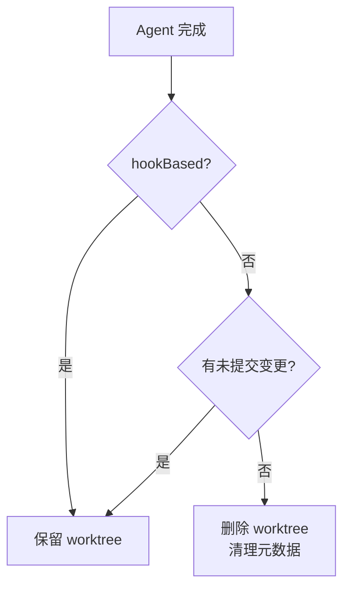
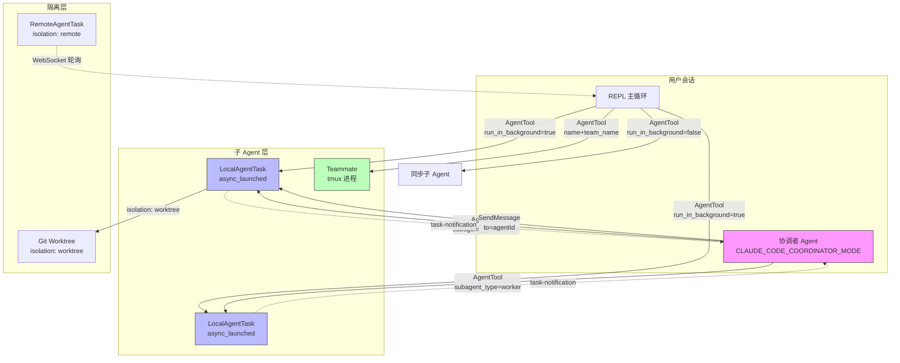

# 第六章：Agent 子系统与多智能体协作

> Claude Code 的 Agent 子系统是其最复杂的模块之一。从单个子任务代理到多智能体并行编排，这套机制将 Claude 从一个交互式助手提升为可以自主分解、并发执行复杂工程任务的编排平台。本章通过阅读真实源码，逐层拆解 Agent 的定义、生命周期、隔离机制与多智能体通信协议。

---

## 6.1 Agent 工具的入口：AgentTool

Agent 子系统的核心入口是 `src/tools/AgentTool/AgentTool.tsx`。这个文件导出了名为 `AgentTool` 的工具定义，它同时兼容两个名称：

```typescript
// src/tools/AgentTool/constants.ts:1-3
export const AGENT_TOOL_NAME = 'Agent'
// Legacy wire name for backward compat
export const LEGACY_AGENT_TOOL_NAME = 'Task'
```

工具名称从 `Task` 改为 `Agent` 是一次重要的语义升级，但为了向后兼容仍保留了旧名称作为别名。

### 输入 Schema

AgentTool 的输入 Schema 分为两层：基础 Schema 和完整 Schema（`src/tools/AgentTool/AgentTool.tsx:82-102`）。

```typescript
// 基础字段（所有情况均可用）
const baseInputSchema = lazySchema(() => z.object({
  description: z.string(),          // 3-5 个词的任务简述
  prompt: z.string(),               // 子 Agent 执行的完整指令
  subagent_type: z.string().optional(), // 指定 Agent 类型
  model: z.enum(['sonnet', 'opus', 'haiku']).optional(), // 模型覆盖
  run_in_background: z.boolean().optional(), // 是否后台异步运行
}));

// 完整 Schema 额外包含多智能体参数
const fullInputSchema = lazySchema(() => {
  const multiAgentInputSchema = z.object({
    name: z.string().optional(),        // Agent 名称（供 SendMessage 路由）
    team_name: z.string().optional(),   // 所属团队
    mode: permissionModeSchema().optional(), // 权限模式（如 "plan"）
  });
  return baseInputSchema().merge(multiAgentInputSchema).extend({
    isolation: z.enum(['worktree']).optional(), // 隔离模式
    cwd: z.string().optional(),                 // 工作目录覆盖
  });
});
```

值得注意的是，`isolation` 字段在外部版本中只支持 `'worktree'`，内部版本额外支持 `'remote'`（调度到远程 CCR 环境）。`cwd` 字段由 `feature('KAIROS')` 门控，不在所有版本中可见。

### 输出状态机

Agent 执行完成后的输出有四种状态，构成一个清晰的状态机（`src/tools/AgentTool/AgentTool.tsx:141-191`）：

| 状态 | 含义 |
|---|---|
| `completed` | 同步执行完毕，包含完整结果 |
| `async_launched` | 已异步启动，返回 agentId 和 outputFile 路径 |
| `teammate_spawned` | 以 tmux 模式生成了一个并行 Teammate |
| `remote_launched` | 在远端 CCR 会话中启动（仅内部版本） |

---

## 6.2 Agent 的生命周期：runAgent

`src/tools/AgentTool/runAgent.ts` 是执行 Agent 核心逻辑的生成器函数，其签名揭示了 Agent 运行时所需的全部上下文（`runAgent.ts:248-329`）：

```typescript
export async function* runAgent({
  agentDefinition,   // Agent 的定义（System Prompt、工具集）
  promptMessages,    // 初始消息（用户指令）
  toolUseContext,    // 继承自父 Agent 的工具调用上下文
  canUseTool,        // 权限检查函数
  isAsync,           // 是否异步运行
  model,             // 模型别名覆盖
  availableTools,    // 子 Agent 可用工具池
  worktreePath,      // worktree 隔离路径
  description,       // 任务描述（用于通知）
  // ... 其他参数
}): AsyncGenerator<Message, void>
```

`runAgent` 是一个**异步生成器**，逐条 yield Message，让调用方可以实时处理流式输出。这是整个流式渲染管道的基础。

### 模型解析

子 Agent 的模型通过三层优先级解析（`runAgent.ts:340-345`）：

```typescript
const resolvedAgentModel = getAgentModel(
  agentDefinition.model,          // Agent 定义中的默认模型
  toolUseContext.options.mainLoopModel, // 父 Agent 使用的模型
  model,                          // 调用时显式传入的覆盖
  permissionMode,                 // 权限模式（影响某些模型选择）
)
```

优先级从低到高：Agent 定义 < 父模型继承 < 显式覆盖。

### MCP 服务器初始化

子 Agent 支持在其 YAML frontmatter 中声明专属 MCP 服务器（`runAgent.ts:95-217`）。初始化时分两类处理：
- **字符串引用**（如 `"github"`）：复用父 Agent 已连接的 MCP 客户端（缓存共享）
- **内联定义**（`{ serverName: config }`）：独立创建，Agent 结束时清理

---

## 6.3 同步 vs 异步执行路径

AgentTool 的 `call()` 方法中，Agent 是否异步运行由多个因素共同决定（`AgentTool.tsx:567`）：

```typescript
const shouldRunAsync = (
  run_in_background === true ||
  selectedAgent.background === true || // Agent 定义中 background: true
  isCoordinator ||                     // 协调者模式下强制异步
  forceAsync ||                        // fork 实验门控
  assistantForceAsync ||               // KAIROS/Assistant 模式
  (proactiveModule?.isProactiveActive() ?? false)
) && !isBackgroundTasksDisabled;
```

**同步路径**：父 Agent 阻塞等待子 Agent 完成，适合需要子任务结果才能继续的场景。

**异步路径**：子 Agent 在独立 fiber 中运行，通过 `<task-notification>` XML 消息回传结果，父 Agent 可继续处理其他工作。核心注册调用（`AgentTool.tsx:688-698`）：

```typescript
const agentBackgroundTask = registerAsyncAgent({
  agentId: asyncAgentId,
  description,
  prompt,
  selectedAgent,
  setAppState: rootSetAppState,
  // 不链接父 AbortController —— 按 ESC 不会杀掉后台 Agent
  toolUseId: toolUseContext.toolUseId
});
```

后台 Agent 的中止需要显式执行 `chat:killAgents` 命令，这是一个有意的设计决策：防止用户误按 ESC 终止长时间运行的后台任务。

---

## 6.4 Worktree 隔离机制

当 `isolation: 'worktree'` 时，Agent 会在一个独立的 Git worktree 中工作，与主工作区完全隔离（`AgentTool.tsx:583-593`）：

```typescript
if (effectiveIsolation === 'worktree') {
  const slug = `agent-${earlyAgentId.slice(0, 8)}`;
  worktreeInfo = await createAgentWorktree(slug);
}
```

Agent 执行完毕后，根据是否有未提交变更决定是否保留 worktree（`AgentTool.tsx:644-685`）：



Fork 路径（实验性功能）在 worktree 模式下还会向子 Agent 注入一条特殊通知，告知它当前工作目录已切换，需要重新读取可能已过期的文件。

---

## 6.5 Fork 子 Agent 实验

`src/tools/AgentTool/forkSubagent.ts` 实现了一个实验性功能：当 `subagent_type` 未指定且 `FORK_SUBAGENT` 特性门控开启时，子 Agent 会**继承父 Agent 的完整对话上下文和 System Prompt**，而不是从头开始（`forkSubagent.ts:60-71`）：

```typescript
export const FORK_AGENT = {
  agentType: FORK_SUBAGENT_TYPE,
  tools: ['*'],          // 继承父工具集
  maxTurns: 200,
  model: 'inherit',      // 继承父模型
  permissionMode: 'bubble', // 权限提示冒泡到父终端
  source: 'built-in',
  getSystemPrompt: () => '',
} satisfies BuiltInAgentDefinition
```

Fork 的设计目标是**提示缓存共享**：所有 fork 子 Agent 具有字节完全相同的 API 请求前缀，因此可以命中同一个 Anthropic 提示缓存条目，大幅降低 token 成本。

防止递归 fork 的保护（`forkSubagent.ts:78-88`）通过检测消息历史中的 `<fork-boilerplate>` 标签来实现。

---

## 6.6 本地 Agent 任务：LocalAgentTask

`src/tasks/LocalAgentTask/LocalAgentTask.tsx` 管理后台 Agent 的本地状态，核心数据结构追踪进度（`LocalAgentTask.tsx:33-49`）：

```typescript
export type AgentProgress = {
  toolUseCount: number;       // 已使用工具次数
  tokenCount: number;         // 累计 token 消耗
  lastActivity?: ToolActivity; // 最近一次工具调用
  recentActivities?: ToolActivity[]; // 最近 5 次活动
  summary?: string;            // AI 生成的进度摘要
};
```

Token 计数有细节需要注意：`input_tokens` 在 API 中是**累积值**（包含所有历史 token），所以取最新值而非求和；`output_tokens` 是**每轮新增值**，需要累加（`LocalAgentTask.tsx:74`）：

```typescript
// input_tokens 是累积值，取最新
tracker.latestInputTokens = usage.input_tokens + cache_creation + cache_read;
// output_tokens 是每轮值，累加
tracker.cumulativeOutputTokens += usage.output_tokens;
```

---

## 6.7 远程 Agent 任务：RemoteAgentTask

`src/tasks/RemoteAgentTask/RemoteAgentTask.tsx` 处理在远端云环境（CCR）中运行的 Agent，支持多种任务类型（`RemoteAgentTask.tsx:60-61`）：

```typescript
const REMOTE_TASK_TYPES = [
  'remote-agent',   // 普通远程 Agent
  'ultraplan',      // 长时间规划任务
  'ultrareview',    // 代码审查
  'autofix-pr',     // PR 自动修复
  'background-pr',  // 后台 PR 处理
] as const
```

远程任务通过 WebSocket 长轮询获取状态更新，本地维护一份 `log: SDKMessage[]` 记录所有消息事件。

---

## 6.8 协调者模式（Coordinator Mode）

协调者模式通过环境变量 `CLAUDE_CODE_COORDINATOR_MODE=1` 开启，核心逻辑在 `src/coordinator/coordinatorMode.ts`。

```typescript
// src/coordinator/coordinatorMode.ts:36-41
export function isCoordinatorMode(): boolean {
  if (feature('COORDINATOR_MODE')) {
    return isEnvTruthy(process.env.CLAUDE_CODE_COORDINATOR_MODE)
  }
  return false
}
```

协调者有专属 System Prompt（`coordinatorMode.ts:116-127`），其角色定义明确：

> 你是 Claude Code，一个跨多个 worker 协调软件工程任务的 AI 助手。你的工作是：帮助用户达成目标、指导 worker 研究/实现/验证代码变更、综合结果与用户沟通。

协调者独有的工具集（`coordinatorMode.ts:29-34`）：

```typescript
const INTERNAL_WORKER_TOOLS = new Set([
  TEAM_CREATE_TOOL_NAME,
  TEAM_DELETE_TOOL_NAME,
  SEND_MESSAGE_TOOL_NAME,
  SYNTHETIC_OUTPUT_TOOL_NAME,
])
```

**Worker 通知格式**：Worker 完成后通过 `<task-notification>` XML 消息回传（协调者 System Prompt 中有完整示例，`coordinatorMode.ts:148-161`）：

```xml
<task-notification>
  <task-id>{agentId}</task-id>
  <status>completed|failed|killed</status>
  <summary>{人类可读摘要}</summary>
  <result>{Agent 最终文本输出}</result>
  <usage>
    <total_tokens>N</total_tokens>
    <tool_uses>N</tool_uses>
    <duration_ms>N</duration_ms>
  </usage>
</task-notification>
```

---

## 6.9 多智能体通信：SendMessage 工具

`src/tools/SendMessageTool/SendMessageTool.ts` 实现了 Agent 间的消息传递。它支持三类目标（通过 `to` 字段路由）：
1. **agentId**：直接路由到 LocalAgentTask
2. **命名 Agent**（通过注册表）：`name → agentId` 映射在 `AppState.agentNameRegistry` 中维护
3. **Teammate**：通过 mailbox 文件系统机制（tmux 进程间通信）

SendMessage 还支持结构化消息类型（`SendMessageTool.ts:46-62`），包括 `shutdown_request`、`shutdown_response`、`plan_approval_response` 等协议消息，用于 Agent 协商生命周期管理。

---

## 6.10 团队管理：TeamCreate / TeamDelete

`src/tools/TeamCreateTool/TeamCreateTool.ts` 实现了 Agent 团队的创建，输入 Schema（`TeamCreateTool.ts:37-49`）：

```typescript
z.strictObject({
  team_name: z.string(),        // 团队名称
  description: z.string().optional(),  // 团队用途描述
  agent_type: z.string().optional(),   // 团队 Lead 的角色类型
})
```

团队状态通过 JSON 文件（TeamFile）持久化，支持多进程间的协调。输出包含 `team_file_path` 和 `lead_agent_id`，是后续 Teammate 注册的基础。

---

## 6.11 内置 Agent 类型

`src/tools/AgentTool/builtInAgents.ts` 定义了内置 Agent 的注册逻辑。在普通模式下，内置 Agent 包括：

- **general-purpose**：通用 Agent，无特殊限制
- **statusline-setup**：状态栏初始化专用
- **explore**（门控）：代码库探索
- **plan**（门控）：任务规划
- **code-guide**（非 SDK 模式）：编码向导
- **verification**：代码验证

在协调者模式下，内置 Agent 替换为 `worker`（通过 `getCoordinatorAgents()` 加载），专门用于接收和执行协调者分发的任务。

---

## 6.12 多智能体架构全景



### 关键设计决策

1. **后台 Agent 不继承父 AbortController**：按 ESC 取消主线程不会意外杀死正在运行的后台任务，需要显式 `chat:killAgents`。

2. **Teammate 不能再生成 Teammate**（`AgentTool.tsx:272-274`）：团队成员列表是扁平的，不支持嵌套，避免层级混乱。

3. **协调者模式下模型参数被忽略**（`AgentTool.tsx:252`）：`const model = isCoordinatorMode() ? undefined : modelParam;`，防止协调者越权控制 worker 的模型选择。

4. **Worktree 清理策略**：Agent 结束后若无未提交变更则自动清理，有变更则保留供人工审查，体现了"安全第一"的设计原则。

---

## 小结

Claude Code 的 Agent 子系统以 `AgentTool` 为核心，通过 `runAgent` 生成器实现了流式异步执行，通过 `LocalAgentTask` 和 `RemoteAgentTask` 管理本地与远程两类后台任务的生命周期，通过 `SendMessage`/`TeamCreate`/`TeamDelete` 构建了完整的多智能体通信协议。协调者模式提供了一个专用的编排层，让 Claude 可以像真正的工程 PM 一样并行调度多个专项 worker，同时通过 worktree 隔离、权限冒泡、模型继承等机制确保子 Agent 的安全边界。
