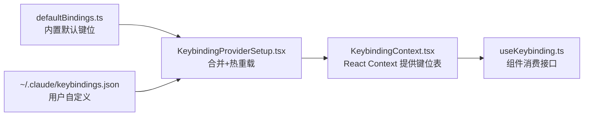
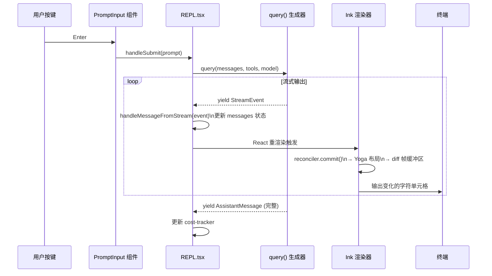

# 第七章：终端 UI——React 在 CLI 中的实践

> Claude Code 将 React 带入了终端，在命令行界面中实现了组件化、声明式的 UI 编程模型。这不是简单地使用某个 Ink 库，而是对 Ink 进行了深度定制和重写：自定义 reconciler、双缓冲帧渲染、Yoga 布局引擎、Vim 模式输入、可配置的键位绑定系统……本章从 `src/ink/` 目录出发，逐层解析 React 组件如何最终变成终端上的字符。

---

## 7.1 入口：从 main.tsx 到 Ink 实例

`src/main.tsx` 是整个 CLI 的启动点。与浏览器端 React 调用 `ReactDOM.render()` 类似，Claude Code 使用 Ink 的 `render()` 函数将 React 树挂载到终端。`main.tsx` 第 34 行导入了类型定义：

```typescript
// src/main.tsx:34
import type { Root } from './ink.js';
```

实际的渲染启动封装在 `src/interactiveHelpers.ts` 的 `renderAndRun` 函数中，它负责创建 Ink 实例并将顶层组件树（`<REPL>` 或各种对话框）注入终端。

`src/ink.js` 是对外暴露的 Ink API 汇总文件，重新导出了 `Box`、`Text`、`useInput`、`useStdin`、`useTheme` 等核心接口，供所有组件使用。

---

## 7.2 Ink 的核心：一个定制的 React Renderer

Claude Code 并未使用 npm 上的标准 `ink` 包，而是在 `src/ink/` 目录中维护了一套**完全重写的 Ink 实现**。核心文件是 `src/ink/ink.tsx`。

### Ink 类

`src/ink/ink.tsx` 第 76 行定义了核心的 `Ink` 类：

```typescript
export default class Ink {
  private readonly container: FiberRoot;  // React Fiber 根节点
  private rootNode: dom.DOMElement;       // 自定义 DOM 根节点
  readonly focusManager: FocusManager;    // 焦点管理
  private renderer: Renderer;             // 字符渲染器
  private readonly stylePool: StylePool;  // 样式对象池
  private charPool: CharPool;             // 字符对象池
  private hyperlinkPool: HyperlinkPool;   // 超链接对象池
  private frontFrame: Frame;              // 前缓冲区
  private backFrame: Frame;               // 后缓冲区
  // ...
}
```

其中**双缓冲帧（front/back frame）**是性能优化的关键：每次渲染先写入 backFrame，然后与 frontFrame 做 diff，只把变化的单元格输出到终端。这避免了全屏刷新，大幅减少写入量。

### 渲染调度

渲染不是每次状态变化都立即触发，而是经过节流（`ink.tsx:212-216`）：

```typescript
const deferredRender = (): void => queueMicrotask(this.onRender);
this.scheduleRender = throttle(deferredRender, FRAME_INTERVAL_MS, {
  leading: true,
  trailing: true
});
```

帧间隔来自 `src/ink/constants.ts:2`：

```typescript
export const FRAME_INTERVAL_MS = 16  // ~60fps
```

渲染使用 `queueMicrotask` 延迟到当前微任务队列末尾，这确保了 React 的 `useLayoutEffect` 在 `onRender` 触发前已经完成（比如 `useDeclaredCursor` 更新光标位置），避免光标跟踪落后一帧的问题。

### React Fiber 容器

Ink 类在构造函数中创建 React Fiber 容器（`ink.tsx:262-269`）：

```typescript
this.container = reconciler.createContainer(
  this.rootNode,
  ConcurrentRoot,  // 使用 React 18 并发模式
  null,
  false,
  null,
  'id',
  noop, noop, noop, noop
);
```

使用了 React 的 **Concurrent Root**（并发模式），这意味着 Claude Code 的 UI 支持时间切片和 Suspense 等现代 React 特性。

---

## 7.3 自定义 Reconciler

`src/ink/reconciler.ts` 是整个渲染引擎的心脏，它使用 `react-reconciler` 包构建了一个非浏览器 DOM 的自定义渲染目标。

```typescript
// src/ink/reconciler.ts:224-239
const reconciler = createReconciler<
  ElementNames,   // 元素类型名称
  Props,
  DOMElement,     // 容器类型
  DOMElement,     // 实例类型
  TextNode,
  // ...
>({
  getRootHostContext: () => ({ isInsideText: false }),
  prepareForCommit: () => null,
  resetAfterCommit(rootNode) {
    // 触发布局计算 + 渲染调度
    rootNode.onComputeLayout?.()
  },
  // ...
})
```

`resetAfterCommit` 在每次 React 提交（commit）后触发布局计算，然后调度渲染帧。这是 React 更新 → Yoga 布局 → 终端输出三个阶段的衔接点。

### 自定义 DOM 元素

Ink 定义了一套精简的"DOM"元素类型（`src/ink/dom.ts:19-26`）：

```typescript
export type ElementNames =
  | 'ink-root'          // 根节点
  | 'ink-box'           // 块级容器（对应 React 的 <Box>）
  | 'ink-text'          // 文本节点（对应 <Text>）
  | 'ink-virtual-text'  // 虚拟文本（不占布局空间）
  | 'ink-link'          // 可点击链接
  | 'ink-progress'      // 进度条
  | 'ink-raw-ansi'      // 原始 ANSI 转义序列
```

每个 React 组件（如 `<Box>`、`<Text>`）最终映射为这些内部节点，由 reconciler 通过 `createInstance` 函数创建。

---

## 7.4 布局引擎：Yoga in WASM

Ink 使用 **Yoga**（Meta 开发的 Flexbox 布局引擎）计算元素的位置和大小。代码中的 `yogaNode` 引用（`dom.ts:14`）、`ink.tsx:247-257` 中的布局计算调用，以及 `src/native-ts/yoga-layout/` 目录中的 WASM 包，共同构成了布局计算层：

```typescript
// src/ink/ink.tsx:247-257
this.rootNode.yogaNode.setWidth(this.terminalColumns);
this.rootNode.yogaNode.calculateLayout(this.terminalColumns);
const ms = performance.now() - t0;
recordYogaMs(ms);
```

布局宽度设置为终端列数（`terminalColumns`），在终端窗口 `resize` 事件触发时重新计算。

### 布局性能追踪

Yoga 计算时间通过 `recordYogaMs()` 记录，可在 DevBar（`src/components/DevBar.tsx`）中实时看到，用于排查 UI 卡顿问题。

---

## 7.5 屏幕渲染：差量输出

`src/ink/render-node-to-output.ts` 将 DOM 树渲染为一个"屏幕缓冲区"，然后 `src/ink/render-to-screen.ts` 对比前后两帧，只输出有变化的部分。

**布局位移检测**（`render-node-to-output.ts:34-41`）：

```typescript
let layoutShifted = false

export function didLayoutShift(): boolean {
  return layoutShifted
}
```

当检测到布局发生位移（元素位置/大小变化），渲染器会使用"全屏刷新"而不是差量更新，确保不会出现残影。稳态帧（如 spinner 旋转、时钟更新）通常不触发布局位移，可以走 O(changed cells) 的差量路径。

### 滚动优化

对于滚动操作，Ink 实现了 DECSTBM 硬件滚动优化（`render-node-to-output.ts:49`）：当 `ScrollBox` 的 `scrollTop` 变化时，生成一个 `ScrollHint`，`log-update.ts` 据此发送终端的硬件滚动指令（`CSI n S`/`CSI n T`），而不是重写整个视口。

---

## 7.6 主 REPL 组件

`src/screens/REPL.tsx` 是整个 UI 的核心组件，管理用户交互的完整生命周期。它的 import 段长达 280 行，汇集了几乎所有的 Hook 和子组件——这反映了它作为"顶层编排者"的地位。

### REPL 的主要职责

通过阅读 `REPL.tsx` 的 import 段，可以归纳出 REPL 管理的核心关注点：

```
消息历史管理    ← useAssistantHistory, useTurnDiffs
查询执行        ← query(), handlePromptSubmit
权限系统        ← PermissionRequest, useCanUseTool
后台任务        ← useTasksV2, useBackgroundTaskNavigation
键位绑定        ← KeybindingSetup, useCommandKeybindings
会话持久化      ← sessionStorage, adoptResumedSessionFile
费用追踪        ← useCostSummary, cost-tracker
MCP 集成        ← useMergedClients, useMergedTools
Vim 模式        ← useVimInput（在 PromptInput 中）
```

REPL 中的流式输出处理通过 `handleMessageFromStream` 函数实现，它逐条处理 `query()` 生成器 yield 出的消息，将助手的流式响应实时追加到 `messages` 状态数组中，触发 React 重渲染，最终通过 Ink 渲染到终端。

---

## 7.7 键位绑定系统

`src/keybindings/` 目录实现了一套完整的、用户可自定义的键位绑定系统。

### 架构分层



### 默认键位

`src/keybindings/defaultBindings.ts:32` 定义了所有内置快捷键，按 Context 分组：

```typescript
// 全局 Context
'ctrl+c': 'app:interrupt',
'ctrl+d': 'app:exit',
'ctrl+l': 'app:redraw',
'ctrl+t': 'app:toggleTodos',
'ctrl+o': 'app:toggleTranscript',
'ctrl+r': 'history:search',

// Chat Context
'escape': 'chat:cancel',
'ctrl+x ctrl+k': 'chat:killAgents',  // 和弦（chord）
'shift+tab': 'chat:cycleMode',
'enter': 'chat:submit',
```

注意 `ctrl+x ctrl+k` 是一个**和弦（chord）**——需要先按 `ctrl+x`，在 1 秒内再按 `ctrl+k`（超时配置在 `KeybindingProviderSetup.tsx:30`）。

### 键位 Context

`src/keybindings/schema.ts:12-32` 定义了 17 个键位 Context，如 `Global`、`Chat`、`Autocomplete`、`Confirmation`、`Transcript`、`Vim` 等，每个 Context 对应 UI 的特定状态，确保同一按键在不同场景下有不同行为（例如 `escape` 在 Chat Context 是取消，在 Vim 的 NORMAL 模式有不同含义）。

### 用户自定义与热重载

`src/keybindings/KeybindingProviderSetup.tsx` 在启动时监听 `~/.claude/keybindings.json` 的文件变化（`subscribeToKeybindingChanges`），支持**无需重启的热重载**——修改键位文件后立即生效。

---

## 7.8 Vim 模式

`src/hooks/useVimInput.ts` 实现了完整的 Vim 输入模式，这是 Claude Code 在 CLI 用户体验上的亮点之一。

### 状态机设计

Vim 输入通过 `vimStateRef` 维护状态（`useVimInput.ts:35`）：

```typescript
const vimStateRef = React.useRef<VimState>(createInitialVimState())
const [mode, setMode] = useState<VimMode>('INSERT')
```

`VimState` 包含当前模式（`INSERT`/`NORMAL`）和命令积累状态（如 `d2w` 这样的复合命令）。

### 模式切换

```typescript
// useVimInput.ts:77 - Escape 切换到 NORMAL 模式
vimStateRef.current = { mode: 'NORMAL', command: { type: 'idle' } }

// useVimInput.ts:54 - i/a/o 等切换回 INSERT 模式
vimStateRef.current = { mode: 'INSERT', insertedText: '' }
```

### 方向键映射

在 NORMAL 模式下，方向键被映射为 Vim 动作（`useVimInput.ts:263-268`）：

```typescript
let vimInput = input
if (key.leftArrow)  vimInput = 'h'
else if (key.rightArrow) vimInput = 'l'
else if (key.upArrow)    vimInput = 'k'
else if (key.downArrow)  vimInput = 'j'
```

状态转换由 `src/vim/transitions.ts` 中的 `transition()` 函数驱动，支持完整的 Vim 动作和操作符组合，如 `d2w`（删除两个词）、`ci"`（改变引号内内容）等。

`src/components/VimTextInput.tsx` 是对 `useVimInput` 的组件封装，供 `PromptInput` 使用；普通的文本输入则走 `src/components/TextInput.tsx` 加上 `useTextInput` Hook。

---

## 7.9 费用追踪

`src/cost-tracker.ts` 负责追踪当前会话的 API 费用，其数据来源于 `src/bootstrap/state.ts` 中的全局状态计数器。

核心数据结构（`cost-tracker.ts:71-80`）：

```typescript
type StoredCostState = {
  totalCostUSD: number
  totalAPIDuration: number
  totalAPIDurationWithoutRetries: number
  totalToolDuration: number
  totalLinesAdded: number
  totalLinesRemoved: number
  lastDuration: number | undefined
  modelUsage: { [modelName: string]: ModelUsage } | undefined
}
```

`src/costHook.ts` 中的 `useCostSummary` Hook 在 `process.exit` 事件时将费用摘要写入 stdout，并将状态持久化到项目配置文件（`cost-tracker.ts:15-22`）：

```typescript
export function useCostSummary(getFpsMetrics?: () => FpsMetrics | undefined): void {
  useEffect(() => {
    const f = () => {
      if (hasConsoleBillingAccess()) {
        process.stdout.write('\n' + formatTotalCost() + '\n')
      }
      saveCurrentSessionCosts(getFpsMetrics?.())
    }
    process.on('exit', f)
    return () => { process.off('exit', f) }
  }, [])
}
```

费用状态可以在 Session 恢复时重建（`restoreCostStateForSession`），确保 `--resume` 重启后显示累计而非清零的费用。

---

## 7.10 关键 Hook 概览

`src/hooks/` 目录包含 80+ 个 Hook，涵盖了 REPL 所有的副作用和交互逻辑。以下是最核心的几个：

| Hook 文件 | 功能 |
|---|---|
| `useTextInput.ts` | 基础文本输入状态管理（光标、选区、历史） |
| `useVimInput.ts` | Vim 模式输入（基于 useTextInput 扩展） |
| `useCommandKeybindings.tsx` | 将键位绑定动作映射到 REPL 命令处理函数 |
| `useGlobalKeybindings.tsx` | 全局键位处理（不依赖 Context 聚焦状态） |
| `useMainLoopModel.ts` | 主循环模型状态（支持运行时切换） |
| `useQueueProcessor.ts` | 异步消息队列处理（防止并发冲突） |
| `useCancelRequest.ts` | Ctrl+C 取消当前请求 |
| `useExitOnCtrlCD.ts` | 双击 Ctrl+C/D 退出（防误触） |
| `useArrowKeyHistory.tsx` | 上下键浏览历史输入 |
| `useTerminalSize.ts` | 监听终端 resize 事件 |
| `useVirtualScroll.ts` | 长消息列表的虚拟滚动 |
| `useLogMessages.ts` | 调试日志消息管理 |

---

## 7.11 消息渲染流水线

从用户按下 Enter 到流式 LLM 输出显示在终端，完整流水线如下：



关键性能特征：
- React **Concurrent Mode** 允许渲染工作被中断，不会因大量消息涌入而卡住输入
- Ink 的 **差量渲染** 确保每帧只写入变化的终端单元格
- **`queueMicrotask` 延迟** 确保 `useLayoutEffect`（如光标位置）在渲染前就绪

---

## 7.12 屏幕组织

`src/screens/` 目录包含三个顶层屏幕：

- **`REPL.tsx`**：主交互屏幕，包含消息历史、输入框、状态栏
- **`Doctor.tsx`**：`/doctor` 命令的诊断屏幕，展示系统状态信息
- **`ResumeConversation.tsx`**：会话恢复选择屏幕

实际的渲染启动逻辑在 `src/interactiveHelpers.ts` 的 `renderAndRun` 和 `showSetupScreens` 函数中，负责在屏幕之间切换（如首次运行显示 onboarding，之后直接进 REPL）。

---

## 7.13 终端适配层

`src/ink/terminal.ts` 处理不同终端的兼容性差异，包括：

- **Kitty 键盘协议**（扩展按键支持）：通过 `ENABLE_KITTY_KEYBOARD` / `DISABLE_KITTY_KEYBOARD` 序列控制
- **xterm.js 检测**：用于 VSCode 集成的特殊行为（如滚动曲线调整）
- **鼠标跟踪**：alt-screen 模式下开启，支持点击和悬停交互
- **SYNC_OUTPUT_SUPPORTED**：DEC 私有序列 `?2026`，支持原子化帧输出（避免撕裂）

`src/ink/termio/` 目录封装了各类终端控制序列（CSI、DEC、OSC），为上层渲染逻辑提供干净的 API。

---

## 小结

Claude Code 终端 UI 的技术栈可以这样总结：

```
React (Concurrent Mode)
    ↓ react-reconciler (自定义)
Ink DOM (ink-box, ink-text, ...)
    ↓ Yoga WASM
Flexbox 布局
    ↓ render-node-to-output
Screen Buffer (双缓冲)
    ↓ writeDiffToTerminal
终端 ANSI 字符输出
```

这套架构让 UI 代码可以像 Web 前端一样用 React 组件和 Hook 来写，同时通过深度定制的渲染管道（双缓冲差量、Yoga 布局、节流帧调度）达到了终端 UI 所需的高性能输出。Vim 模式、用户可定义键位绑定、费用追踪等功能，则展示了这套架构在细节体验上的用心程度。
