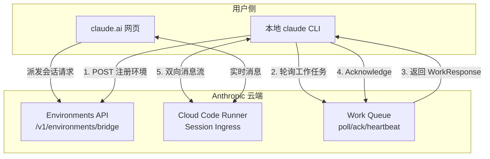
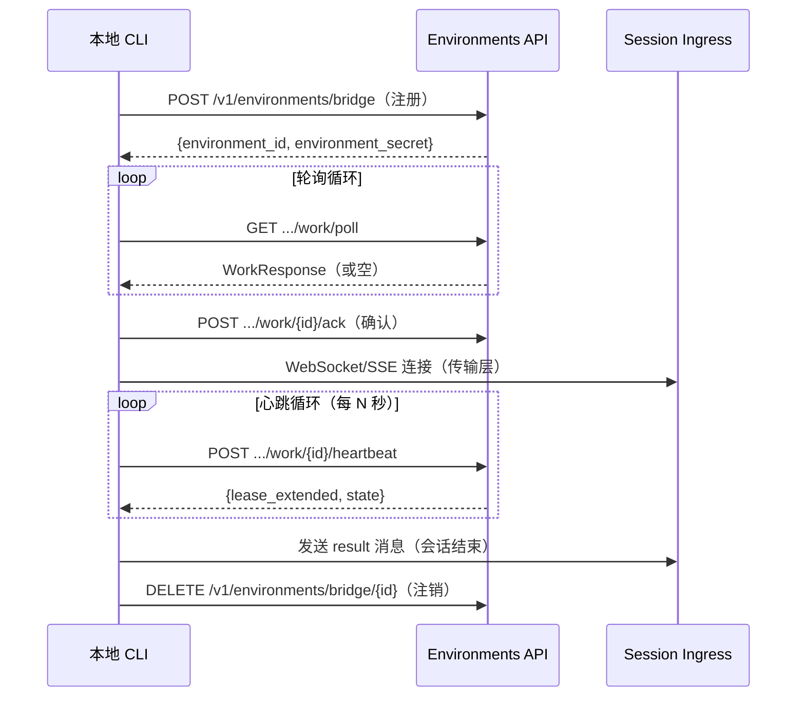

# 第8章：Remote Control Bridge——云端远程控制架构

> Claude Code 不仅是一个本地命令行工具，它还内置了一套完整的远程控制系统，允许用户通过 claude.ai 网页界面远程驱动本地 CLI 会话。本章深入剖析这套被称为 "Bridge"（桥接层）的远程控制架构：它如何建立云端与本地的双向通信、如何管理会话生命周期，以及传输层的技术演进。

## 8.1 什么是 Bridge？

在源码目录 `src/bridge/` 中有 31 个文件，这是整个 Claude Code 代码库中规模最大、逻辑最复杂的子系统之一。Bridge 的核心使命是：**让用户能够从 claude.ai 网页界面远程操控运行在本地机器上的 Claude Code CLI 实例**。

这个功能在代码中被称为 "Remote Control"（远程控制），对应用户可见的命令 `claude remote-control`。

### 为什么需要 Bridge？

Claude Code 在本地终端运行，可以访问本地文件系统、执行 shell 命令。而 claude.ai 是一个 Web 应用，无法直接操控本地进程。Bridge 系统正是为了解决这个天然隔离而设计的：

- **本地端**：CLI 进程注册自己为一个"环境"（Environment），持续轮询服务器获取工作任务
- **云端**：claude.ai 通过 Anthropic API 向该环境派发会话请求
- **传输层**：WebSocket 或 SSE 承载实时的消息双向流动

### 功能门控

Bridge 功能需要满足多个条件才会启用，这在 `src/bridge/bridgeEnabled.ts` 中有明确体现：

```typescript
// src/bridge/bridgeEnabled.ts:28-36
export function isBridgeEnabled(): boolean {
  return feature('BRIDGE_MODE')
    ? isClaudeAISubscriber() &&
        getFeatureValue_CACHED_MAY_BE_STALE('tengu_ccr_bridge', false)
    : false
}
```

三个条件缺一不可：
1. 构建时启用了 `BRIDGE_MODE` feature flag
2. 用户拥有 claude.ai 订阅（`isClaudeAISubscriber()`）
3. GrowthBook 功能标志 `tengu_ccr_bridge` 为 true

这意味着 Bridge 是一个**仅对 claude.ai 订阅者开放的付费功能**，并通过服务端功能标志灰度发布。

## 8.2 系统架构总览



整体流程分为五个阶段：
1. **注册**：CLI 调用 `POST /v1/environments/bridge`，获得 `environment_id` 和 `environment_secret`
2. **轮询**：调用 `GET /v1/environments/{id}/work/poll`，等待工作任务
3. **任务接收**：服务端返回 `WorkResponse`，包含会话 ID 和加密的 `WorkSecret`
4. **确认**：调用 `POST .../work/{id}/ack` 声明已接受任务
5. **会话执行**：通过 WebSocket 或 SSE 传输层与 Session Ingress 双向通信

## 8.3 API 客户端层（bridgeApi.ts）

`src/bridge/bridgeApi.ts` 实现了所有与 Environments API 交互的 HTTP 调用，封装为 `BridgeApiClient` 接口。

### 核心 API 端点

| 方法 | 端点 | 用途 |
|------|------|------|
| POST | `/v1/environments/bridge` | 注册桥接环境 |
| GET | `/v1/environments/{id}/work/poll` | 轮询工作任务 |
| POST | `.../work/{id}/ack` | 确认接受任务 |
| POST | `.../work/{id}/heartbeat` | 保活心跳 |
| POST | `.../work/{id}/stop` | 停止任务 |
| DELETE | `/v1/environments/bridge/{id}` | 注销环境 |
| POST | `/v1/sessions/{id}/events` | 发送权限响应事件 |

所有请求都必须携带专用的 Beta 头：

```typescript
// src/bridge/bridgeApi.ts:38
const BETA_HEADER = 'environments-2025-11-01'
```

### 安全：ID 路径注入防护

注意到一个细节——在将服务端返回的 ID 插入 URL 路径前，代码会做严格的字符白名单校验：

```typescript
// src/bridge/bridgeApi.ts:41-53
const SAFE_ID_PATTERN = /^[a-zA-Z0-9_-]+$/

export function validateBridgeId(id: string, label: string): string {
  if (!id || !SAFE_ID_PATTERN.test(id)) {
    throw new Error(`Invalid ${label}: contains unsafe characters`)
  }
  return id
}
```

这防止了形如 `../../admin` 的路径穿越攻击。

### OAuth 401 重试机制

Bridge API 实现了与主 API 调用路径一致的 OAuth token 刷新逻辑：

```typescript
// src/bridge/bridgeApi.ts:106-139
async function withOAuthRetry<T>(
  fn: (accessToken: string) => Promise<{ status: number; data: T }>,
  context: string,
): Promise<{ status: number; data: T }> {
  const response = await fn(accessToken)
  if (response.status !== 401) return response

  // 尝试刷新 token，成功则重试一次
  const refreshed = await deps.onAuth401(accessToken)
  if (refreshed) {
    const retryResponse = await fn(newToken)
    if (retryResponse.status !== 401) return retryResponse
  }
  return response // 刷新失败，返回 401
}
```

## 8.4 传输层演进：v1 与 v2

Bridge 经历了一次重要的传输层升级，源码中清晰地保留了两套实现的痕迹。

### v1：HybridTransport（WebSocket + POST）

v1 传输层使用 `HybridTransport`（`src/cli/transports/HybridTransport.js`）：
- **读**：WebSocket 长连接接收服务端推送
- **写**：HTTP POST 发送消息到 Session Ingress

### v2：SSETransport + CCRClient

v2 传输层拆分了读写通道，在 `src/bridge/replBridgeTransport.ts` 中有详细说明：

```typescript
// src/bridge/replBridgeTransport.ts:16-21
// - v1: HybridTransport (WS reads + POST writes to Session-Ingress)
// - v2: SSETransport (reads) + CCRClient (writes to CCR v2 /worker/*)
//
// The v2 write path goes through CCRClient.writeEvent → SerialBatchEventUploader,
// NOT through SSETransport.write()
```

v2 的核心优势：
- **批量写入**：`SerialBatchEventUploader` 将多条消息合并发送，减少 HTTP 往返
- **序列号续传**：SSE 传输层维护 `lastSequenceNum`，传输中断重连时服务端可从断点续传，避免重放整个会话历史
- **状态上报**：通过 `PUT /worker` 向服务端汇报当前状态（如 `requires_action` 表示等待用户权限确认）

v2 的启用同样由 GrowthBook 标志控制：

```typescript
// src/bridge/bridgeEnabled.ts:126-130
export function isEnvLessBridgeEnabled(): boolean {
  return feature('BRIDGE_MODE')
    ? getFeatureValue_CACHED_MAY_BE_STALE('tengu_bridge_repl_v2', false)
    : false
}
```

## 8.5 消息协议（bridgeMessaging.ts）

`src/bridge/bridgeMessaging.ts` 是传输层的核心逻辑，处理消息的解析、路由和去重。

### 消息类型体系

Bridge 传输的消息分为三大类，通过 `type` 字段区分：

| 消息类型 | 方向 | 用途 |
|----------|------|------|
| `user` | 云端 → 本地 | 用户输入，触发 CLI 处理 |
| `assistant` | 本地 → 云端 | Claude 的回复，展示给用户 |
| `control_request` | 双向 | 会话控制（初始化、中断、切换模型等） |
| `control_response` | 双向 | 对控制请求的响应 |
| `result` | 本地 → 云端 | 会话结束信号，触发服务端归档 |
| `system` (local_command) | 本地 → 云端 | 斜杠命令执行事件 |

### 消息过滤规则

并非所有本地消息都会转发到 Bridge，`isEligibleBridgeMessage` 函数定义了过滤规则：

```typescript
// src/bridge/bridgeMessaging.ts:77-88
export function isEligibleBridgeMessage(m: Message): boolean {
  // 虚拟消息（REPL 内部调用）只显示，不转发
  if ((m.type === 'user' || m.type === 'assistant') && m.isVirtual) {
    return false
  }
  return (
    m.type === 'user' ||
    m.type === 'assistant' ||
    (m.type === 'system' && m.subtype === 'local_command')
  )
}
```

### Echo 去重机制

由于 WebSocket/SSE 的广播特性，CLI 发出的消息可能被服务端回传给自己（Echo）。`BoundedUUIDSet` 类用一个固定容量的环形缓冲区追踪最近发送的 UUID，实现 O(1) 的去重查找：

```typescript
// src/bridge/bridgeMessaging.ts:429-461
export class BoundedUUIDSet {
  private readonly capacity: number
  private readonly ring: (string | undefined)[]
  private readonly set = new Set<string>()
  private writeIdx = 0

  add(uuid: string): void {
    // 环形写入，淘汰最旧条目
    const evicted = this.ring[this.writeIdx]
    if (evicted !== undefined) this.set.delete(evicted)
    this.ring[this.writeIdx] = uuid
    this.set.add(uuid)
    this.writeIdx = (this.writeIdx + 1) % this.capacity
  }
}
```

### 服务端控制请求处理

`handleServerControlRequest` 函数处理来自服务端的控制指令，这些指令必须在约 10-14 秒内响应，否则服务端会断开 WebSocket：

```typescript
// src/bridge/bridgeMessaging.ts:243-391
switch (request.request.subtype) {
  case 'initialize':
    // 返回最小化能力集：commands=[], models=[], pid=process.pid
    break
  case 'set_model':
    onSetModel?.(request.request.model)
    break
  case 'set_permission_mode':
    // 支持动态切换权限模式（auto/default/manual）
    break
  case 'interrupt':
    onInterrupt?.()
    break
}
```

## 8.6 会话类型系统（types.ts）

`src/bridge/types.ts` 定义了 Bridge 系统的核心数据类型。

### BridgeConfig：环境配置

```typescript
// src/bridge/types.ts:81-115
export type BridgeConfig = {
  dir: string            // 工作目录
  machineName: string    // 机器标识（用于 claude.ai 显示）
  branch: string         // 当前 git 分支
  gitRepoUrl: string | null
  maxSessions: number    // 最大并发会话数
  spawnMode: SpawnMode   // 会话隔离模式
  bridgeId: string       // 客户端生成的 UUID
  workerType: string     // 工作类型标识
  // ...
}
```

### SpawnMode：会话隔离模式

三种会话工作目录策略，通过 `SpawnMode` 类型控制：

```typescript
// src/bridge/types.ts:63-69
export type SpawnMode = 'single-session' | 'worktree' | 'same-dir'
```

- `single-session`：单会话模式，CLI 在会话结束后退出
- `worktree`：每个会话获得独立的 git worktree（最强隔离）
- `same-dir`：多个会话共享同一目录（可能互相干扰）

### WorkSecret：加密的工作凭据

服务端派发的工作任务中包含一个 base64url 编码的 `WorkSecret`，其中包含该会话的 OAuth token、API 基础 URL、MCP 配置等：

```typescript
// src/bridge/types.ts:33-51
export type WorkSecret = {
  version: number
  session_ingress_token: string   // 会话接入 token
  api_base_url: string
  sources: Array<{ type: string; git_info?: {...} }>
  auth: Array<{ type: string; token: string }>
  mcp_config?: unknown | null     // 可携带 MCP 服务器配置
  environment_variables?: Record<string, string> | null
  use_code_sessions?: boolean     // v2 路径标志
}
```

## 8.7 Env-less Bridge（remoteBridgeCore.ts）

`src/bridge/remoteBridgeCore.ts` 实现了一种更轻量的 Bridge 变体——"无 Environments API 层"（Env-less）。

### 架构对比

```
v1 (env-based) 流程:
  1. POST /v1/environments/bridge  → 注册环境，获取 environment_id
  2. GET  .../work/poll            → 长轮询
  3. POST .../work/{id}/ack        → 确认任务
  4. WebSocket                     → 建立传输
  5. POST .../work/{id}/heartbeat  → 定期心跳
  6. DELETE .../environments/...   → 注销

v2 (env-less) 流程:
  1. POST /v1/code/sessions        → 创建会话
  2. POST /v1/code/sessions/{id}/bridge → 获取 worker_jwt + worker_epoch
  3. createV2ReplTransport(jwt, epoch)  → SSE + CCRClient
  4. 定期刷新 /bridge 凭证（proactive_refresh）
```

注释中对这个简化的意义有详细说明：

```typescript
// src/bridge/remoteBridgeCore.ts:14-28
// No register/poll/ack/stop/heartbeat/deregister environment lifecycle.
// The Environments API historically existed because CCR's /worker/*
// endpoints required a session_id+role=worker JWT that only the work-dispatch
// layer could mint. Server PR #292605 adds the /bridge endpoint as a direct
// OAuth→worker_jwt exchange, making the env layer optional for REPL sessions.
```

## 8.8 会话执行器（sessionRunner.ts）

在多会话模式（`worktree`、`same-dir`）下，Bridge 的环境侧（`remote-control`）需要动态孵化子 CLI 进程来执行每个会话。这个逻辑在 `src/bridge/sessionRunner.ts` 中实现。

子进程通过标准的 `spawn()` 系统调用启动，CLI 在子进程模式下通过 `--sdk-url` 参数接收会话接入 URL：

```typescript
// src/bridge/sessionRunner.ts:45-43（类型定义）
export type PermissionRequest = {
  type: 'control_request'
  request_id: string
  request: {
    subtype: 'can_use_tool'    // 特定工具调用权限请求
    tool_name: string
    input: Record<string, unknown>
    tool_use_id: string
  }
}
```

当子会话需要用户审批工具调用时，`control_request` 消息通过 Bridge 传输到 claude.ai，用户在网页上点击允许/拒绝，响应通过 `sendPermissionResponseEvent` 反向传回。

## 8.9 会话生命周期与健康管理



心跳机制是保持会话租约的关键。`heartbeatWork` API 使用 `session_ingress_token`（JWT，不访问数据库）而非 `environment_secret`，从而避免对数据库的高频访问：

```typescript
// src/bridge/bridgeApi.ts:387-417
async heartbeatWork(
  environmentId: string,
  workId: string,
  sessionToken: string,  // JWT token，非 environment_secret
): Promise<{ lease_extended: boolean; state: string }>
```

## 8.10 直连服务（server/ 目录）

`src/server/` 目录下有三个文件，实现了一个更轻量的**直连模式**（Direct Connect）：

- `directConnectManager.ts`：WebSocket 直连会话管理
- `createDirectConnectSession.ts`：创建直连会话
- `types.ts`：类型定义

与 Bridge 的"云端中转"不同，直连模式通过 WebSocket 直接连接到会话，配置包含：

```typescript
// src/server/directConnectManager.ts:13-18
export type DirectConnectConfig = {
  serverUrl: string
  sessionId: string
  wsUrl: string
  authToken?: string
}
```

这是一个更低延迟的通信路径，适合 IDE 插件等本地集成场景（如 VS Code、JetBrains 扩展），它们可以与 CLI 建立直接的 WebSocket 连接，无需经过 Anthropic 云端中转。

## 8.11 小结

Bridge 系统是 Claude Code 从单机 CLI 工具向云端协作平台演进的核心基础设施。其设计体现了几个工程亮点：

1. **渐进式传输升级**：v1（WS+POST）到 v2（SSE+批量上传）的演进保留了完整的向后兼容
2. **回弹设计**：序列号续传、心跳保活、OAuth 自动刷新，保证了不稳定网络下的可靠性
3. **安全防御**：ID 路径注入校验、功能门控分层、设备信任令牌，多层防护
4. **可观测性**：详尽的 debug 日志、活动环形缓冲区（最近 10 条）、诊断日志接口
5. **最小化耦合**：`initReplBridge` 和 `initBridgeCore` 的拆分，避免了命令注册表等重型模块进入 Agent SDK 打包产物

理解 Bridge 架构，对于理解 Claude Code 如何实现跨设备、跨平台的协作工作流至关重要。
