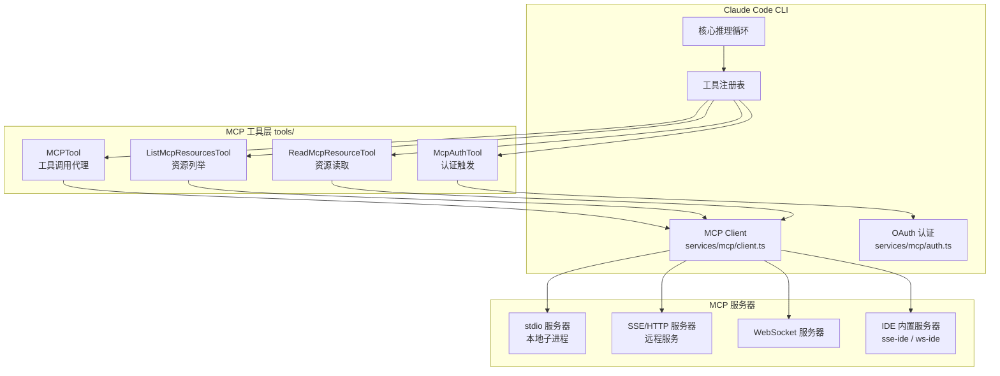
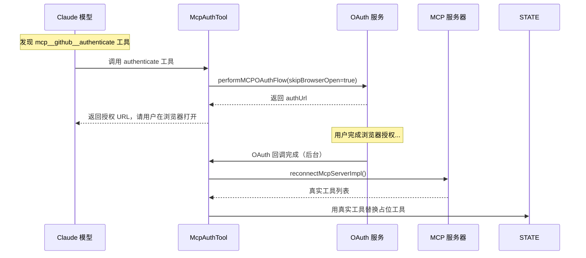
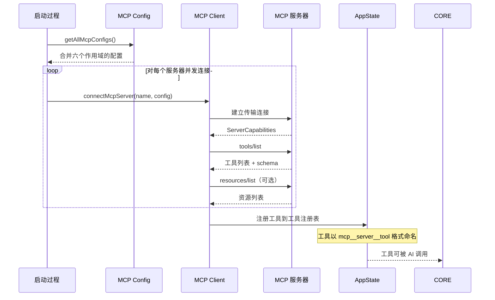

# 第9章：MCP 协议集成——可扩展的工具生态

> Model Context Protocol（MCP）是 Anthropic 推出的开放标准，让 AI 助手能够通过统一接口连接外部服务和数据源。Claude Code 对 MCP 的集成深度远超表面——从多传输协议支持、动态工具发现、OAuth 认证流程，到二进制资源处理和工具命名空间管理，构成了一个完整的可扩展工具生态系统。本章基于 `src/tools/` 和 `src/services/mcp/` 目录的源码，系统分析这套集成架构。

## 9.1 MCP 是什么？它解决什么问题？

在 MCP 出现之前，AI 工具集成面临严重的碎片化问题：每个 AI 应用需要为每个外部服务单独实现连接逻辑、认证机制、数据格式转换。这导致大量重复工作，且工具集无法在不同 AI 系统间复用。

MCP 的核心思想是为 AI 与外部世界的交互定义一套标准协议：

- **工具（Tools）**：可执行的操作，如查询数据库、调用 API
- **资源（Resources）**：可读取的数据，如文件内容、文档
- **提示词（Prompts）**：预定义的交互模板
- **肘击（Elicitation）**：服务端主动向客户端请求额外信息

Claude Code 作为 MCP 客户端，可以连接任意数量的 MCP 服务器，将其工具无缝集成到 AI 的工具调用循环中。

## 9.2 MCP 系统架构



## 9.3 传输协议：八种接入方式

`src/services/mcp/types.ts` 中的 `TransportSchema` 枚举了主要六种传输类型：

```typescript
// src/services/mcp/types.ts:23-26
export const TransportSchema = lazySchema(() =>
  z.enum(['stdio', 'sse', 'sse-ide', 'http', 'ws', 'sdk']),
)
```

此外，还有两种内部专用类型（`ws-ide`、`claudeai-proxy`）拥有各自独立的 config schema，不在主 enum 中。所有八种类型如下：

| 传输类型 | 适用场景 | 认证支持 |
|----------|----------|----------|
| `stdio` | 本地子进程（最常见） | 无需认证 |
| `sse` | 远程 HTTP 服务（Server-Sent Events） | OAuth 支持 |
| `http` | 远程 HTTP 服务（Streamable HTTP） | OAuth 支持 |
| `ws` | WebSocket 服务 | 自定义 headers |
| `sse-ide` | IDE 内置 SSE 服务器（内部类型，含于主 enum） | 无需认证 |
| `ws-ide` | IDE WebSocket 服务器（内部类型，独立 schema） | auth token |
| `sdk` | SDK 内嵌服务器 | 无需认证 |
| `claudeai-proxy` | claude.ai 连接器代理（内部类型，独立 schema） | claude.ai OAuth |

IDE 相关的传输类型（`sse-ide`、`ws-ide`）是内部专用类型，专为 VS Code、JetBrains 等 IDE 扩展与 CLI 建立 MCP 连接而设计：

```typescript
// src/services/mcp/types.ts:69-87
// Internal-only server type for IDE extensions
export const McpSSEIDEServerConfigSchema = lazySchema(() =>
  z.object({
    type: z.literal('sse-ide'),
    url: z.string(),
    ideName: z.string(),
    ideRunningInWindows: z.boolean().optional(),
  }),
)
```

## 9.4 配置作用域：六层配置来源

MCP 服务器的配置可以来自六个不同的作用域，优先级和来源各不相同：

```typescript
// src/services/mcp/types.ts:10-21
export const ConfigScopeSchema = lazySchema(() =>
  z.enum([
    'local',        // 当前项目（.claude/settings.local.json）
    'user',         // 用户全局（~/.claude/settings.json）
    'project',      // 项目共享（.claude/settings.json 或 .mcp.json）
    'dynamic',      // 运行时动态添加
    'enterprise',   // 企业管控（managed-mcp.json）
    'claudeai',     // claude.ai 账户关联的 MCP 连接器
    'managed',      // 托管配置
  ]),
)
```

项目级 MCP 服务器（scope: 'project'）需要用户明确审批才能激活——这是一个安全机制，防止恶意代码库通过 `.mcp.json` 自动启动危险的 MCP 服务器。审批状态由 `getProjectMcpServerStatus()` 跟踪。

## 9.5 工具命名空间：mcp__server__tool 约定

MCP 工具的命名是理解整个系统的关键。`src/services/mcp/mcpStringUtils.ts` 完整定义了命名规则：

### 命名格式

所有 MCP 工具遵循三段式命名：

```
mcp__{服务器名}__{工具名}
```

例如：`mcp__github__create_issue`、`mcp__filesystem__read_file`

### 构建和解析函数

```typescript
// src/services/mcp/mcpStringUtils.ts:50-52
export function buildMcpToolName(serverName: string, toolName: string): string {
  return `${getMcpPrefix(serverName)}${normalizeNameForMCP(toolName)}`
}

// src/services/mcp/mcpStringUtils.ts:39-41
export function getMcpPrefix(serverName: string): string {
  return `mcp__${normalizeNameForMCP(serverName)}__`
}
```

`normalizeNameForMCP()` 函数将服务器名中的特殊字符统一处理，保证合法的工具名格式。

### 解析函数

```typescript
// src/services/mcp/mcpStringUtils.ts:19-32
export function mcpInfoFromString(toolString: string): {
  serverName: string
  toolName: string | undefined
} | null {
  const parts = toolString.split('__')
  const [mcpPart, serverName, ...toolNameParts] = parts
  if (mcpPart !== 'mcp' || !serverName) return null
  // 注意：工具名中的双下划线通过 join 保留
  const toolName = toolNameParts.length > 0
    ? toolNameParts.join('__') : undefined
  return { serverName, toolName }
}
```

这个命名空间设计有重要的安全含义：当权限规则匹配工具名时，会使用完全限定名 `mcp__server__tool`，而不是工具的显示名，避免恶意 MCP 服务器伪装成内置工具绕过权限检查：

```typescript
// src/services/mcp/mcpStringUtils.ts:60-66
export function getToolNameForPermissionCheck(tool: {
  name: string
  mcpInfo?: { serverName: string; toolName: string }
}): string {
  return tool.mcpInfo
    ? buildMcpToolName(tool.mcpInfo.serverName, tool.mcpInfo.toolName)
    : tool.name
}
```

## 9.6 MCPTool：动态工具代理

`src/tools/MCPTool/MCPTool.ts` 是一个特殊的工具定义——它本身是一个**模板**，在运行时被 `src/services/mcp/client.ts` 中的真实 MCP 工具实例覆盖。

```typescript
// src/tools/MCPTool/MCPTool.ts:27-77
export const MCPTool = buildTool({
  isMcp: true,
  // 以下字段均在 mcpClient.ts 中被覆盖为实际值
  name: 'mcp',
  async description() { return DESCRIPTION },  // 实际为空字符串
  async prompt() { return PROMPT },              // 实际为空字符串
  inputSchema: z.object({}).passthrough(),       // 允许任意输入

  async call() {
    return { data: '' }  // 实际逻辑在 mcpClient.ts 中注入
  },

  async checkPermissions(): Promise<PermissionResult> {
    return {
      behavior: 'passthrough',
      message: 'MCPTool requires permission.',
    }
  },
})
```

关键字段 `maxResultSizeChars: 100_000` 限制了单次工具调用结果的最大大小为 10 万字符，防止 MCP 服务器返回过大内容撑爆上下文窗口。

当 MCP 客户端连接时，`client.ts` 会为每个 MCP 工具创建一个定制化的工具对象，覆盖 `MCPTool` 模板的名称、描述、输入 schema 和实际调用逻辑。

### 工具描述长度限制

为防止 OpenAPI 生成的 MCP 服务器将大量 API 文档塞入工具描述，客户端有强制截断：

```typescript
// src/services/mcp/client.ts:218
const MAX_MCP_DESCRIPTION_LENGTH = 2048
```

## 9.7 MCP 客户端连接逻辑

`src/services/mcp/client.ts` 是整个 MCP 集成的核心，使用了官方的 `@modelcontextprotocol/sdk` 包。连接时会根据传输类型选择不同的传输实现：

```typescript
// src/services/mcp/client.ts（导入部分）
import { Client } from '@modelcontextprotocol/sdk/client/index.js'
import { SSEClientTransport } from '@modelcontextprotocol/sdk/client/sse.js'
import { StdioClientTransport } from '@modelcontextprotocol/sdk/client/stdio.js'
import {
  StreamableHTTPClientTransport,
} from '@modelcontextprotocol/sdk/client/streamableHttp.js'
import { WebSocketTransport } from '../../utils/mcpWebSocketTransport.js'
```

### 连接状态机

每个 MCP 服务器连接有四种状态：

```typescript
// src/services/mcp/types.ts:180-210（推断）
type MCPServerConnection =
  | ConnectedMCPServer   // 已连接，可调用工具
  | FailedMCPServer      // 连接失败
  | NeedsAuthMCPServer   // 需要 OAuth 认证
  | PendingMCPServer     // 等待用户审批（项目级）
```

连接失败后并不直接报错，而是以 `FailedMCPServer` 状态存储，让其他服务器的工具仍然可用——局部故障不影响整体。

### 工具超时

MCP 工具调用默认超时极长，约 27.8 小时：

```typescript
// src/services/mcp/client.ts:211
const DEFAULT_MCP_TOOL_TIMEOUT_MS = 100_000_000
```

这是一个刻意的设计选择：MCP 工具可能需要执行长时间运行的操作（如大型代码分析、数据库迁移），不应被短超时中断。用户可通过 `MCP_TOOL_TIMEOUT` 环境变量覆盖此值。

### LRU 缓存的资源列表

资源列表（`resources/list`）的结果被 LRU 缓存：

```typescript
// src/tools/ListMcpResourcesTool/ListMcpResourcesTool.ts:79-84
// fetchResourcesForClient is LRU-cached (by server name) and already
// warm from startup prefetch. Cache is invalidated on onclose and on
// resources/list_changed notifications, so results are never stale.
```

启动时预热、断连时失效、服务端推送变更通知时自动刷新——这套缓存策略在性能和一致性之间取得了平衡。

## 9.8 资源系统

MCP 资源（Resources）是区别于工具调用的另一类能力，允许 AI 读取外部数据源的内容。

### ListMcpResourcesTool

`src/tools/ListMcpResourcesTool/ListMcpResourcesTool.ts` 列出所有已连接服务器提供的资源：

```typescript
// 输入 schema
z.object({
  server: z.string().optional()  // 可选：按服务器名过滤
})

// 输出 schema
z.array(z.object({
  uri: z.string(),          // 资源的唯一标识符，如 file:///path/to/file
  name: z.string(),         // 人类可读名称
  mimeType: z.string().optional(),
  description: z.string().optional(),
  server: z.string(),       // 来源服务器名
}))
```

调用时并发查询所有服务器（`Promise.all`），单个服务器失败不影响其他服务器的结果。

### ReadMcpResourceTool

`src/tools/ReadMcpResourceTool/ReadMcpResourceTool.ts` 按 URI 读取具体资源内容，支持文本和二进制内容：

```typescript
// src/tools/ReadMcpResourceTool/ReadMcpResourceTool.ts:75-143
async call(input, { options: { mcpClients } }) {
  const result = await connectedClient.client.request(
    { method: 'resources/read', params: { uri } },
    ReadResourceResultSchema,
  )

  // 处理二进制 blob：解码 base64，写入磁盘，返回文件路径
  const contents = await Promise.all(
    result.contents.map(async (c, i) => {
      if ('text' in c) {
        return { uri: c.uri, mimeType: c.mimeType, text: c.text }
      }
      if ('blob' in c) {
        // 将 base64 二进制写入临时文件，避免污染上下文
        const persisted = await persistBinaryContent(
          Buffer.from(c.blob, 'base64'),
          c.mimeType,
          persistId,
        )
        return { uri: c.uri, mimeType: c.mimeType, blobSavedTo: persisted.filepath }
      }
    })
  )
}
```

**二进制内容的处理策略**值得关注：MCP 资源可能返回图片、PDF 等二进制文件（base64 编码）。如果直接将 base64 字符串放入 AI 上下文，一张图片就能消耗大量 token。`persistBinaryContent` 将内容写入磁盘临时文件，上下文中只保留文件路径，大幅节省 token 消耗。

## 9.9 OAuth 认证：McpAuthTool

`src/tools/McpAuthTool/McpAuthTool.ts` 是一个精妙的设计——它是一个**占位工具**（pseudo-tool），在 MCP 服务器尚未完成 OAuth 认证时，以工具的形式呈现给 AI，引导模型触发认证流程。

### 工作机制



### 工具名称约定

认证工具的名称遵循同样的命名约定：

```typescript
// src/tools/McpAuthTool/McpAuthTool.ts:63
name: buildMcpToolName(serverName, 'authenticate'),
// 例如：mcp__github__authenticate
```

### 认证后的状态更新

OAuth 完成后，通过 `setAppState` 原子性地替换工具列表：

```typescript
// src/tools/McpAuthTool/McpAuthTool.ts:142-161
setAppState(prev => ({
  ...prev,
  mcp: {
    ...prev.mcp,
    clients: prev.mcp.clients.map(c =>
      c.name === serverName ? result.client : c,
    ),
    tools: [
      ...reject(prev.mcp.tools, t => t.name?.startsWith(prefix)),
      ...result.tools,  // 用真实工具替换占位工具
    ],
    commands: [...],
    resources: ...,
  },
}))
```

利用 `getMcpPrefix(serverName)` 前缀，精确移除该服务器的所有旧工具（包括 `authenticate` 占位工具），替换为真实工具列表。

### 传输类型限制

并非所有传输类型都支持 OAuth 认证工具触发：

```typescript
// src/tools/McpAuthTool/McpAuthTool.ts:101-108
if (config.type !== 'sse' && config.type !== 'http') {
  return {
    data: {
      status: 'unsupported',
      message: `Server "${serverName}" uses ${transport} transport which does not
        support OAuth from this tool...`,
    },
  }
}
```

`stdio` 类型的服务器不需要 OAuth（本地进程），`claudeai-proxy` 类型有独立的认证流程（通过 `/mcp` 命令手动操作）。

## 9.10 认证缓存机制

为了避免在每次连接时都重走 OAuth 流程，客户端维护了一个磁盘级的认证缓存：

```typescript
// src/services/mcp/client.ts:257-316
const MCP_AUTH_CACHE_TTL_MS = 15 * 60 * 1000  // 15 分钟

// 缓存文件：~/.claude/mcp-needs-auth-cache.json
function getMcpAuthCachePath(): string {
  return join(getClaudeConfigHomeDir(), 'mcp-needs-auth-cache.json')
}
```

缓存记录哪些服务器处于"需要认证"状态（HTTP 401 触发），有效期 15 分钟。在此期间，不会重复尝试连接这些服务器（避免频繁 401 攻击）。

并发写入通过 Promise 串行化防止竞态：

```typescript
// src/services/mcp/client.ts:291-308
let writeChain = Promise.resolve()

function setMcpAuthCacheEntry(serverId: string): void {
  writeChain = writeChain.then(async () => {
    // 串行读-改-写，避免并发覆盖
  })
}
```

## 9.11 错误处理体系

MCP 客户端定义了多个专门的错误类型：

### McpAuthError
```typescript
// src/services/mcp/client.ts:152-159
export class McpAuthError extends Error {
  serverName: string
  // 捕获此错误时将服务器状态更新为 'needs-auth'
}
```

### McpSessionExpiredError
```typescript
// src/services/mcp/client.ts:165-170
class McpSessionExpiredError extends Error {
  // HTTP 404 + JSON-RPC code -32001
  // 触发：清除连接缓存，获取新连接，重试
}
```

会话过期检测逻辑同时检查 HTTP 状态码和 JSON-RPC 错误码，避免把普通 404（URL 错误、服务器下线）误判为会话过期：

```typescript
// src/services/mcp/client.ts:194-206
export function isMcpSessionExpiredError(error: Error): boolean {
  const httpStatus = 'code' in error ? error.code : undefined
  if (httpStatus !== 404) return false
  // 检查 JSON-RPC 错误码 -32001
  return (
    error.message.includes('"code":-32001') ||
    error.message.includes('"code": -32001')
  )
}
```

### McpToolCallError
```typescript
// src/services/mcp/client.ts:177-186
export class McpToolCallError_I_VERIFIED_THIS_IS_NOT_CODE_OR_FILEPATHS
  extends TelemetrySafeError_I_VERIFIED_THIS_IS_NOT_CODE_OR_FILEPATHS {
  // 当工具返回 isError: true 时抛出
  // 携带 _meta 字段，允许 SDK 消费者接收错误元数据
}
```

## 9.12 MCP 与 IDE 集成

`sse-ide` 和 `ws-ide` 传输类型是 Claude Code 与 IDE 扩展集成的专用通道。当 VS Code 或 JetBrains 插件运行时，CLI 会尝试通过这些类型连接到 IDE 内置的 MCP 服务器，从而获得：

- **诊断信息**：IDE 语言服务器的错误、警告
- **文件监视**：IDE 打开的文件、当前选中内容
- **编辑器操作**：在 IDE 中打开文件、跳转到位置

连接成功后，`maybeNotifyIDEConnected()` 会通知 IDE 插件，建立双向的工具调用通道：

```typescript
// src/services/mcp/client.ts:73
import { maybeNotifyIDEConnected } from '../../utils/ide.js'
```

## 9.13 MCP Elicitation：服务端主动请求

`src/services/mcp/client.ts` 中还实现了 MCP Elicitation 协议——允许 MCP 服务器在工具调用执行过程中主动向客户端请求额外信息：

```typescript
// src/services/mcp/client.ts（导入部分）
import {
  ElicitRequestSchema,
  type ElicitRequestURLParams,
  type ElicitResult,
} from '@modelcontextprotocol/sdk/types.js'
```

这是 MCP 规范的高级特性：工具执行到一半时，服务器可以"反向"向 AI 客户端发起请求，例如要求用户确认某个操作、提供额外参数。Elicitation 的处理由 `runElicitationHooks` 完成，支持多个钩子函数串联处理。

## 9.14 整体工具发现流程



## 9.15 小结

Claude Code 的 MCP 集成是一个工程成熟度相当高的实现，几个设计决策值得关注：

1. **工具命名空间隔离**：`mcp__server__tool` 三段式命名防止了跨服务器工具名冲突，也阻断了 MCP 工具伪装内置工具绕过权限检查的攻击向量。

2. **优雅降级**：单个 MCP 服务器连接失败不影响其他服务器，`FailedMCPServer` 状态让系统在局部故障下仍然可用。

3. **二进制内容处理**：将 base64 blob 持久化到磁盘而不是注入上下文，这是一个关键的 token 经济性决策。

4. **认证作为工具**：`McpAuthTool` 将 OAuth 流程包装成一个 AI 可以直接调用的工具，让模型能够自主触发认证，无需用户手动运行命令。

5. **多层配置作用域**：六个配置来源（local/user/project/enterprise/claudeai/managed）覆盖了从个人开发者到企业托管的所有使用场景。

6. **协议扩展性**：通过支持 Elicitation 等 MCP 规范的高级特性，Claude Code 为未来更复杂的人机协作模式奠定了基础。

MCP 不仅是 Claude Code 的扩展机制，更是 Anthropic 推动 AI 工具集成标准化的战略布局。理解 Claude Code 的 MCP 实现，有助于开发者构建兼容、健壮的 MCP 服务器。
