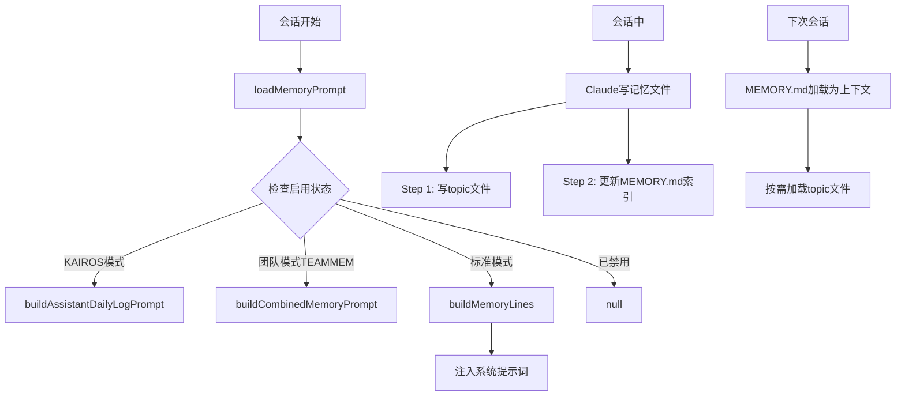

# 第10章：插件、技能与记忆系统

> Claude Code 不只是一个固定功能的命令行工具——它是一个可扩展的平台，通过插件（Plugin）、技能（Skill）和持久记忆（Memory）三大机制，赋予 AI 跨会话学习、按需扩展能力的能力。本章深入拆解这三套系统的设计与实现细节。

---

## 10.1 插件架构：什么是插件，如何被加载

### 插件的定义

Claude Code 的插件系统分为两类：**内置插件（Built-in Plugin）** 和 **外部市场插件（Marketplace Plugin）**。

内置插件的定义类型位于 `src/types/plugin.ts`：

```typescript
// src/types/plugin.ts:18-35
export type BuiltinPluginDefinition = {
  name: string
  description: string
  version?: string
  skills?: BundledSkillDefinition[]
  hooks?: HooksSettings
  mcpServers?: Record<string, McpServerConfig>
  isAvailable?: () => boolean
  defaultEnabled?: boolean
}
```

一个插件可以捆绑多种组件：技能（skills）、钩子（hooks）、MCP 服务器。这是一种"组件包"的设计理念，而非单一用途的扩展点。

加载后的插件以 `LoadedPlugin` 类型表示：

```typescript
// src/types/plugin.ts:48-70
export type LoadedPlugin = {
  name: string
  manifest: PluginManifest
  path: string
  source: string
  repository: string
  enabled?: boolean
  isBuiltin?: boolean
  sha?: string
  commandsPath?: string
  skillsPath?: string
  outputStylesPath?: string
  hooksConfig?: HooksSettings
  mcpServers?: Record<string, McpServerConfig>
  lspServers?: Record<string, LspServerConfig>
  settings?: Record<string, unknown>
}
```

注意 `lspServers` 字段——插件甚至可以提供 LSP（语言服务器协议）服务器，这揭示了扩展系统的宏大愿景。

### 内置插件注册机制

插件通过 `registerBuiltinPlugin()` 在启动时注册，由 `src/plugins/builtinPlugins.ts` 管理：

```typescript
// src/plugins/builtinPlugins.ts:28-32
export function registerBuiltinPlugin(
  definition: BuiltinPluginDefinition,
): void {
  BUILTIN_PLUGINS.set(definition.name, definition)
}
```

插件 ID 使用 `{name}@builtin` 格式（如 `telegram@builtin`），与市场插件的 `{name}@{marketplace}` 格式区分。

```typescript
// src/plugins/builtinPlugins.ts:70-71
const pluginId = `${name}@${BUILTIN_MARKETPLACE_NAME}`
```

### 插件的启用/禁用逻辑

插件状态由用户设置（`settings.json`）持久化，启用逻辑遵循三层优先级：

```
用户偏好设置 > 插件默认值 > true（默认开启）
```

代码体现在 `getBuiltinPlugins()` 函数中：

```typescript
// src/plugins/builtinPlugins.ts:72-76
const userSetting = settings?.enabledPlugins?.[pluginId]
const isEnabled =
  userSetting !== undefined
    ? userSetting === true
    : (definition.defaultEnabled ?? true)
```

值得关注的是，代码注释明确说明：内置插件在技术上用 `source: 'bundled'` 标记其技能命令，而不是 `source: 'builtin'`，因为后者在 `Command` 类型中保留给硬编码的斜杠命令（`/help`、`/clear` 等）。这种命名区分虽然容易造成混乱，却是为了维持技能工具列表、分析上报和提示词截断豁免等机制的正确运作。

### 当前插件状态

有趣的是，查看 `src/plugins/bundled/index.ts` 可以看到内置插件注册目前是空的：

```typescript
// src/plugins/bundled/index.ts:20-23
export function initBuiltinPlugins(): void {
  // No built-in plugins registered yet — this is the scaffolding for
  // migrating bundled skills that should be user-toggleable.
}
```

这说明完整的插件市场基础设施已经就绪，但从 bundled skills 到用户可切换的 built-in plugins 的迁移还在进行中。

---

## 10.2 技能系统：Skill vs Plugin

### 概念区分

在 Claude Code 中，"技能"和"插件"是两个不同层次的概念：

- **插件（Plugin）**：是一个"发布单元"，可以包含多个技能、钩子和 MCP 服务器
- **技能（Skill）**：是一个可调用的单元，对应一个斜杠命令（如 `/commit`、`/review-pr`）

技能本质上是一种特殊的 `Command` 对象（`type: 'prompt'`），包含：提示词内容、允许的工具列表、何时使用的说明（`whenToUse`）、模型配置等。

### SkillTool：模型调用技能的入口

`SkillTool` 是让 Claude 在对话中调用已注册技能的核心工具，位于 `src/tools/SkillTool/`。

工具提示词明确规定了调用规则：

```typescript
// src/tools/SkillTool/prompt.ts:174-195
`Execute a skill within the main conversation

When users ask you to perform tasks, check if any of the available skills match.
Skills provide specialized capabilities and domain knowledge.

Important:
- Available skills are listed in system-reminder messages in the conversation
- When a skill matches the user's request, this is a BLOCKING REQUIREMENT: invoke
  the relevant Skill tool BEFORE generating any other response about the task
- NEVER mention a skill without actually calling this tool`
```

"BLOCKING REQUIREMENT"——这是一种强制性规范，要求模型必须先调用技能工具，不能只口头提及。这防止了模型"说空话"而不实际执行的行为。

### 技能发现与上下文预算

技能列表不是全量注入系统提示，而是受到**上下文窗口预算**管控：

```typescript
// src/tools/SkillTool/prompt.ts:21-23
export const SKILL_BUDGET_CONTEXT_PERCENT = 0.01
export const CHARS_PER_TOKEN = 4
export const DEFAULT_CHAR_BUDGET = 8_000 // Fallback: 1% of 200k × 4
```

技能列表默认只占用上下文窗口的 1%。当技能数量过多时，系统有三级降级策略：
1. 完整描述（全部放得下时）
2. 截断非内置技能的描述（保留 bundled 技能的完整描述）
3. 仅保留技能名称（极端情况）

```typescript
// src/tools/SkillTool/prompt.ts:96-99
// Partition into bundled (never truncated) and rest
const bundledIndices = new Set<number>()
const restCommands: Command[] = []
for (let i = 0; i < commands.length; i++) {
  const cmd = commands[i]!
  if (cmd.type === 'prompt' && cmd.source === 'bundled') {
    bundledIndices.add(i)
```

每条技能描述单独设有硬性字符上限：

```typescript
// src/tools/SkillTool/prompt.ts:29
export const MAX_LISTING_DESC_CHARS = 250
```

250 字符限制背后的设计哲学：技能列表只是"发现界面"，完整内容在调用时才加载，所以冗长的描述只是浪费首轮缓存 token。

### 技能的来源多样性

SkillTool 聚合了多个来源的技能：

```typescript
// src/tools/SkillTool/SkillTool.ts:81-94
async function getAllCommands(context: ToolUseContext): Promise<Command[]> {
  const mcpSkills = context
    .getAppState()
    .mcp.commands.filter(
      cmd => cmd.type === 'prompt' && cmd.loadedFrom === 'mcp',
    )
  if (mcpSkills.length === 0) return getCommands(getProjectRoot())
  const localCommands = await getCommands(getProjectRoot())
  return uniqBy([...localCommands, ...mcpSkills], 'name')
}
```

技能来源：本地文件系统（`.claude/` 目录）+ 插件 + MCP 服务器提供的技能。

---

## 10.3 记忆系统：让 Claude 跨会话学习

Claude Code 的记忆系统是一套精心设计的持久化知识管理机制，核心文件位于 `src/memdir/`。

### 记忆系统架构



### 记忆存储路径

记忆目录的路径解析有四层优先级（`src/memdir/paths.ts`）：

```
1. CLAUDE_COWORK_MEMORY_PATH_OVERRIDE 环境变量（Cowork 全路径覆盖）
2. settings.json 中的 autoMemoryDirectory（支持 ~/ 展开）
3. <memoryBase>/projects/<sanitized-git-root>/memory/
   （基于 Git 根目录，保证同仓库不同 worktree 共享记忆）
```

```typescript
// src/memdir/paths.ts:223-235
export const getAutoMemPath = memoize(
  (): string => {
    const override = getAutoMemPathOverride() ?? getAutoMemPathSetting()
    if (override) {
      return override
    }
    const projectsDir = join(getMemoryBaseDir(), 'projects')
    return (
      join(projectsDir, sanitizePath(getAutoMemBase()), AUTO_MEM_DIRNAME) + sep
    ).normalize('NFC')
  },
  () => getProjectRoot(),
)
```

一个关键的安全设计：`projectSettings`（即提交到仓库的 `.claude/settings.json`）被**故意排除**在 `autoMemoryDirectory` 的读取范围之外——恶意仓库不能通过此字段将记忆目录重定向到 `~/.ssh` 等敏感路径。

### 记忆文件的双层结构

记忆系统使用 `MEMORY.md` + 主题文件的双层结构：

- **`MEMORY.md`**：索引文件，每条记忆一行，如 `- [Title](file.md) — 一行摘要`
- **主题文件**（如 `user_role.md`、`feedback_testing.md`）：存储详细内容

MEMORY.md 有严格的大小限制：

```typescript
// src/memdir/memdir.ts:35-38
export const ENTRYPOINT_NAME = 'MEMORY.md'
export const MAX_ENTRYPOINT_LINES = 200
export const MAX_ENTRYPOINT_BYTES = 25_000
```

超出限制时，系统会截断内容并附加警告提示，告知模型只有部分内容被加载。

### 记忆的四种类型

记忆系统定义了严格的四类记忆分类（`src/memdir/memoryTypes.ts`）：

```typescript
// src/memdir/memoryTypes.ts:14-19
export const MEMORY_TYPES = [
  'user',      // 用户身份、角色、偏好
  'feedback',  // 工作方式反馈（避免的和应保持的行为）
  'project',   // 项目背景（目标、截止日期、决策）
  'reference', // 外部系统指针（Linear、Grafana等）
] as const
```

**不应该存入记忆的内容**也有明确的排除清单：代码模式、Git 历史、调试方案、CLAUDE.md 中已记录的内容、当前会话的临时状态。

注释中有一个关键评估结论：即使用户明确要求保存 PR 列表，系统也应询问"什么是其中不明显的/令人惊讶的部分"——那才是值得记忆的内容。这防止了记忆系统沦为活动日志。

### 记忆文件格式

每个记忆文件都有标准 frontmatter：

```markdown
---
name: {{memory name}}
description: {{one-line description — used to decide relevance in future conversations}}
type: {{user, feedback, project, reference}}
---

{{memory content}}
```

`description` 字段的设计很有价值：它不仅是标签，更是"相关性判断依据"，在记忆检索时会被专门的模型用于快速筛选。

### 智能记忆检索：用 AI 选 AI 的记忆

`src/memdir/findRelevantMemories.ts` 实现了一个两阶段的记忆检索流程：

```typescript
// src/memdir/findRelevantMemories.ts:39-75
export async function findRelevantMemories(
  query: string,
  memoryDir: string,
  signal: AbortSignal,
  recentTools: readonly string[] = [],
  alreadySurfaced: ReadonlySet<string> = new Set(),
): Promise<RelevantMemory[]> {
  const memories = (await scanMemoryFiles(memoryDir, signal)).filter(
    m => !alreadySurfaced.has(m.filePath),
  )
  // 调用 Sonnet 模型来选择相关记忆（最多5个）
  const selectedFilenames = await selectRelevantMemories(
    query, memories, signal, recentTools,
  )
  ...
}
```

系统用 Sonnet 模型来判断哪些记忆文件与当前查询相关——一种"用 AI 管理 AI 的上下文"的元认知设计。选择器还有一个细节：如果模型最近正在使用某个工具（`recentTools`），就不会推荐关于该工具 API 文档的记忆，避免重复噪声。

### 记忆禁用条件

```typescript
// src/memdir/paths.ts:30-54
export function isAutoMemoryEnabled(): boolean {
  // 优先级：环境变量 > --bare模式 > 无持久存储的远程 > settings.json > 默认开启
  if (isEnvTruthy(process.env.CLAUDE_CODE_DISABLE_AUTO_MEMORY)) return false
  if (isEnvTruthy(process.env.CLAUDE_CODE_SIMPLE)) return false
  if (isEnvTruthy(process.env.CLAUDE_CODE_REMOTE) &&
      !process.env.CLAUDE_CODE_REMOTE_MEMORY_DIR) return false
  const settings = getInitialSettings()
  if (settings.autoMemoryEnabled !== undefined) return settings.autoMemoryEnabled
  return true
}
```

记忆系统在 `--bare` 模式（`CLAUDE_CODE_SIMPLE`）和无持久存储的远程部署中自动禁用。

---

## 10.4 团队记忆与 KAIROS 助手模式

### 团队记忆（TEAMMEM）

通过特性标志 `feature('TEAMMEM')` 启用的团队记忆功能，在个人记忆目录下增加 `team/` 子目录，实现同一项目多个协作者之间共享记忆。

团队记忆与个人记忆的路径关系：
```
~/.claude/projects/<project>/memory/        ← 个人记忆
~/.claude/projects/<project>/memory/team/   ← 团队共享记忆
```

### KAIROS 助手模式

当 `feature('KAIROS')` 激活时，记忆写入模式从"实时维护索引"切换为"每日追加日志"：

```typescript
// src/memdir/memdir.ts:335
// 日志文件路径模式: <autoMemPath>/logs/YYYY/MM/YYYY-MM-DD.md
const logPathPattern = join(memoryDir, 'logs', 'YYYY', 'MM', 'YYYY-MM-DD.md')
```

这种设计专为长期运行的助手会话设计：避免频繁重写索引文件，改为按日期追加日志，再由独立的 `/dream` 技能夜间将日志蒸馏整理成主题文件。

---

## 小结

Claude Code 的插件-技能-记忆三层架构代表了一种清晰的关切分离：

| 层次 | 作用 | 持久化 |
|------|------|--------|
| 插件 | 功能分发/发布单元 | 用户设置（启用/禁用状态） |
| 技能 | 专门能力的封装 | 文件系统（`.claude/commands/`） |
| 记忆 | 跨会话上下文积累 | 结构化文件（`~/.claude/projects/`） |

这三套系统的共同设计原则是**上下文感知的动态加载**：不是一次性注入所有内容，而是按需、按预算、按相关性动态装配上下文——这对于 context window 有限的 LLM 来说是正确的工程选择。
